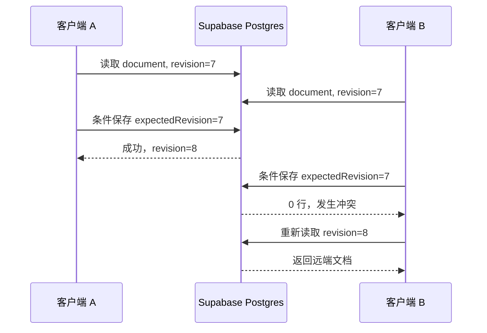

# 保存、乐观并发控制与 Realtime 策略分析

> 分析日期：2026-07-03
> 适用项目：`wire-harness-designer`
> 当前数据模型：`HarnessConfig schemaVersion: 3`
> 目标：解释当前保存机制，并明确后续是否需要 Realtime、如何使用乐观锁及如何处理冲突
>
> **实施更新（2026-07-03）：** 本地保存已改为单一项目文档源和异步
> `ProjectRepository` 接口；原先无项目归属的 `harness-config` 双副本已移除。

---

## 1. 结论先行

### 1.1 推荐结论

**当前前端 MVP 不需要 Realtime。**

建议按以下顺序演进：

1. 当前本地 MVP：本地自动保存、设计 JSON 导入/导出和损坏数据恢复已完成；
2. 接入 Supabase：先实现完整文档保存 + `revision` 乐观锁；
3. 外部试用：根据需要增加“远端已更新”通知，但仍不做实时共同编辑；
4. 明确要求多人同时编辑同一项目后，才设计 Realtime 协作协议。

无论是否使用 Realtime，都建议使用乐观锁。两者职责不同：

| 能力 | 解决的问题 | 能否防覆盖 |
|---|---|---:|
| 自动保存 | 用户不必手动点击保存 | 否 |
| Realtime | 尽快知道其他客户端发生了变化 | 否 |
| 乐观锁 | 保存时发现当前文档已经被别人更新 | **是** |
| Presence | 显示谁正在查看/编辑 | 否 |
| CRDT/OT/服务端命令序列 | 真正合并并发编辑 | 是，但复杂度高 |

最关键的原则是：

> **Realtime 不是冲突解决方案。**
>
> 它只能更早暴露冲突；最终仍需要乐观锁、编辑租约或可合并的操作协议。

### 1.2 当前项目最合适的方案

当前线束文档是一个包含连接器、线材、接线明细、保护套和模型关系的完整 JSON 文档。业务规则还包括：

- 连接器有效侧锁定；
- PIN 范围和重复绑定限制；
- 接线端点关系；
- 连接器换型后的引用裁剪；
- 保护套与线材关联；
- 跨对象唯一 ID。

这些规则使“字段随便合并”存在较大风险。因此第一阶段最稳妥的方案是：

> **整文档 JSONB 保存 + 文档级 revision 乐观锁 + 冲突时暂停自动保存。**

暂不建议直接上 CRDT，也不建议把 React Flow 的每次拖动都通过 Realtime 同步。

---

## 2. 当前系统如何保存

### 2.1 当前存在两类项目数据

| localStorage Key | 内容 | 写入时机 |
|---|---|---|
| `harness-project-config-{projectId}` | 指定项目的完整 `HarnessConfig` | 自动保存、返回项目列表、关闭页面时写入 |
| `harness-projects` | 项目列表、名称、状态、当前项目 | 项目 Store 变化时写入 |
| `harness-project-snapshot-{projectId}-{timestamp}` | 最近的有效恢复点（最多 3 个） | 距上次恢复点至少 5 分钟且项目再次保存时 |
| `harness-project-recovery-{projectId}-{timestamp}` | 结构损坏的原始项目数据 | 加载深层校验失败时写入 |

`HarnessConfig` 只有项目文档这一条正式持久化路径；编辑器 Store 只保存内存工作状态。


### 2.2 自动保存流程

`src/App.tsx` 的行为是：

1. 任何 `config` 变化都会把 `saveState` 改为 `dirty`；
2. `dirty` 且存在当前项目时，设置 2 秒计时器；
3. 2 秒内继续编辑会清除旧计时器并重新计时；
4. 计时结束后：
   - 标记 `saving`；
   - 读取最新 Store 文档；
   - 通过异步仓库接口写入项目文档；
   - 更新项目名称和时间；
   - 标记 `saved`；
5. 写入抛错时标记 `error`。

这是典型的 debounce 自动保存。

### 2.3 离开页面时的保存

本地实现还有两次同步尽力刷新：

- 返回项目列表时同步保存一次；
- `beforeunload` 时同步保存一次。

当前之所以可行，是因为 `localStorage.setItem()` 是同步调用。未来切换到 Supabase 后，网络保存是异步的，不能依赖 `beforeunload` 保证请求完成。

云端模式应改为：

- 编辑过程中持续自动保存；
- 本地保留 recovery draft；
- 返回项目列表时等待当前保存完成；
- 浏览器突然关闭时，下次从本地 recovery draft 恢复；
- 不把 `beforeunload` 当作可靠的云端提交点。

### 2.4 当前保存的优点

- 实现简单；
- 本地编辑延迟低；
- 断网不影响使用；
- 2 秒 debounce 避免每次输入都写项目文档；
- 页面关闭前还能同步写一次；
- 已显示保存状态。

### 2.5 当前保存的风险

#### 项目元数据最终一致

如果修改设计名称后在 2 秒内离开，项目配置可能已经保存新名称，但 `harness-projects` 仍保留旧名称。再次打开时系统会根据项目配置进行修正，因此是最终一致，不是原子保存。

#### 多标签页最后写入覆盖

两个标签页打开同一项目时：

1. A 和 B 都读取版本 X；
2. A 保存 X+A；
3. B 不知道 A 已保存；
4. B 保存 X+B；
5. A 的修改被覆盖。

当前没有：

- `revision`；
- ETag；
- 条件更新；
- `storage` 事件监听；
- `BroadcastChannel`；
- 冲突提示。

#### 本地保存成功不等于长期可靠

清理浏览器数据、换设备、无痕模式或浏览器故障仍会导致数据丢失。完整设计 JSON 导入/导出已经提供手动备份能力；长期可靠性仍应由云端持久化解决。项目级存储失败会进入可见的 `error` 保存状态。

### 2.6 当前代码定位

| 代码位置 | 职责 |
|---|---|
| `src/App.tsx` | 2 秒 debounce、异步保存序列和离开前尽力刷新 |
| `src/repositories/projectRepository.ts` | 异步仓库接口、本地项目文档读写和损坏副本保留 |
| `src/stores/projectStore.ts` | 项目元数据及仓库调用 |
| `src/lib/harnessConfigSchema.ts` | 项目文档深层运行时结构校验 |

---

## 3. 为什么推荐乐观锁

### 3.1 不要使用时间戳充当锁

当前 `HarnessConfig.updatedAt` 不适合做并发令牌：

- 由客户端生成；
- 不同设备时钟可能不一致；
- 毫秒值可能碰撞；
- 用户导入旧文档可能带入旧时间；
- 文档内部时间与数据库保存时间职责不同。

`schemaVersion` 也不能用于并发控制，它代表文档结构版本。

应新增服务端维护的单调递增整数：

```text
revision: 1, 2, 3, 4...
```

### 3.2 推荐表结构

```sql
create table public.project_documents (
  project_id uuid primary key references public.projects(id) on delete cascade,
  document jsonb not null,
  schema_version integer not null,
  revision bigint not null default 1,
  updated_at timestamptz not null default now(),
  updated_by uuid not null references auth.users(id),
  last_save_id uuid
);
```

建议含义：

- `document`：完整 `HarnessConfig`；
- `schema_version`：文档结构版本；
- `revision`：并发控制版本，只能由数据库递增；
- `updated_at`：数据库生成的保存时间；
- `updated_by`：最后保存用户；
- `last_save_id`：可选，用于网络重试幂等判断。

公开 schema 中的表必须启用 RLS。Supabase 官方明确建议暴露给浏览器的表使用 RLS，并通过 `using`/`with check` 限制 UPDATE 前后的行归属。

### 3.3 条件保存

客户端打开项目时读取：

```ts
{
  document,
  revision: 7
}
```

保存时必须携带自己基于的版本：

```ts
{
  document: nextDocument,
  expectedRevision: 7
}
```

数据库只允许：

```sql
update public.project_documents
set
  document = :next_document,
  revision = revision + 1,
  updated_at = now(),
  updated_by = auth.uid()
where project_id = :project_id
  and revision = :expected_revision
returning revision, updated_at;
```

结果：

- 返回 revision 8：保存成功；
- 返回 0 行：版本已经变化、项目不存在或没有权限，不能继续覆盖。

PostgreSQL 在并发 UPDATE 时会等待冲突事务，并重新检查更新后行是否仍满足 `WHERE` 条件。因此两个客户端同时以 revision 7 保存时，最多一个能成功更新，另一个会因条件不再满足而得到 0 行。

### 3.4 推荐使用数据库函数

可以直接使用 Supabase `.update().eq()` 做条件更新。它足以让正常客户端实现乐观锁，但如果表仍允许浏览器直接 UPDATE，客户端理论上可以绕过 `expectedRevision` 条件。

多人共享项目时，更稳妥的方式是：

- 禁止 `authenticated` 直接 UPDATE 文档表；
- 只允许调用保存函数；
- 函数显式检查项目所有者/成员；
- 函数在数据库内递增 revision；
- 使用 `saveId` 识别“数据库已提交但响应丢失”的重试。

下面示例假设 `projects.owner_id` 表示项目所有者；以后支持成员协作时，应替换为 `project_members` 权限检查。

```sql
create or replace function public.save_project_document(
  p_project_id uuid,
  p_expected_revision bigint,
  p_document jsonb,
  p_schema_version integer,
  p_save_id uuid
)
returns table (
  revision bigint,
  updated_at timestamptz
)
language plpgsql
security definer
set search_path = ''
as $$
begin
  if (select auth.uid()) is null then
    raise exception 'Authentication required' using errcode = '42501';
  end if;

  -- 相同 saveId 的响应丢失后重试：返回已提交结果，不再次递增 revision。
  return query
  select d.revision, d.updated_at
  from public.project_documents as d
  join public.projects as p on p.id = d.project_id
  where d.project_id = p_project_id
    and d.last_save_id = p_save_id
    and p.owner_id = (select auth.uid());

  if found then
    return;
  end if;

  return query
  update public.project_documents as d
  set
    document = p_document,
    schema_version = p_schema_version,
    revision = d.revision + 1,
    updated_at = now(),
    updated_by = auth.uid(),
    last_save_id = p_save_id
  where d.project_id = p_project_id
    and d.revision = p_expected_revision
    and exists (
      select 1
      from public.projects as p
      where p.id = d.project_id
        and p.owner_id = (select auth.uid())
    )
  returning d.revision, d.updated_at;
end;
$$;

revoke update on public.project_documents from anon, authenticated;

revoke execute on function public.save_project_document(
  uuid, bigint, jsonb, integer, uuid
) from public, anon;

grant execute on function public.save_project_document(
  uuid, bigint, jsonb, integer, uuid
) to authenticated;
```

客户端：

```ts
const { data, error } = await supabase.rpc('save_project_document', {
  p_project_id: projectId,
  p_expected_revision: baseRevision,
  p_document: snapshot,
  p_schema_version: snapshot.schemaVersion,
  p_save_id: crypto.randomUUID(),
});

if (error) {
  // 网络、权限或服务错误
}

if (!data?.length) {
  // 版本冲突、项目不存在或无权限；重新读取后分类
}
```

这里有意使用 `security definer`，因为直写权限已经被撤销。它必须同时满足：

- 固定空 `search_path`；
- 所有表都写完整 schema；
- 在函数内部显式验证 owner/member；
- 从 `public` 和 `anon` 撤销执行权限；
- 只向 `authenticated` 授予执行权限；
- 文档表仍启用 RLS，用于 SELECT 和其他允许的操作。

如果项目永远只有一个可信客户端，使用 `security invoker` + RLS 会更简单；但它不能在撤销表 UPDATE 权限后代替浏览器完成写入，也不能强制所有客户端必须携带 revision。

### 3.5 自动保存必须串行

切换到异步保存后，不能让多个保存请求并发飞行。

例如：

1. 本地 generation 10 开始保存 revision 7；
2. 请求未返回时，用户继续编辑到 generation 12；
3. generation 10 保存成功，服务端变成 revision 8；
4. 客户端只能更新本地 revision 为 8，不能标记整个文档为 saved；
5. generation 12 仍是 dirty，应继续保存到 revision 9。

推荐状态：

```ts
type CloudSaveState =
  | { status: 'saved'; revision: number }
  | { status: 'dirty'; revision: number; generation: number }
  | { status: 'saving'; revision: number; savingGeneration: number }
  | { status: 'offline'; revision: number }
  | { status: 'conflict'; localRevision: number; remoteRevision: number }
  | { status: 'error'; revision: number; message: string };
```

规则：

- 同时最多一个保存请求；
- 保存请求携带固定 snapshot 和 generation；
- 成功后只确认该 generation；
- 保存期间产生的新编辑继续保持 dirty；
- 网络失败不修改 revision；
- 冲突后暂停自动保存，禁止静默重试覆盖。

---

## 4. 是否可以完全不使用 Realtime

**可以，而且这是当前推荐方案。**

### 4.1 无 Realtime 的工作方式



这已经可以保证 B 不会静默覆盖 A。

### 4.2 无 Realtime 时如何发现远端变化

可选择以下低复杂度方式：

- 打开项目时读取最新 revision；
- 每次保存时由乐观锁检查；
- 页面重新获得焦点时查询一次 revision；
- 从后台恢复到前台时查询一次 revision；
- 可选每 30–60 秒轻量轮询 revision，而不是拉取整个 JSON。

对于“主要由一个人编辑、偶尔换设备或开两个标签页”的产品，这已经足够。

### 4.3 无 Realtime 的优点

- 架构简单；
- 容易测试；
- 不需要维护 WebSocket 生命周期；
- 不会把短暂断线误认为数据冲突；
- 仍能通过 revision 保证不丢修改；
- 更符合当前完整 JSONB 文档保存模式。

### 4.4 无 Realtime 的限制

- 用户不会立即看到别人正在编辑；
- 远端变化通常在保存、聚焦或轮询时才发现；
- 不适合共同拖动画布、共享光标或实时看到对方修改。

这些限制对当前前端 MVP 并不构成阻塞。

---

## 5. 如果使用 Realtime，推荐只做变更通知

### 5.1 第一阶段不要同步完整文档

推荐 Realtime 事件只包含：

```ts
interface ProjectChangedEvent {
  projectId: string;
  revision: number;
  updatedAt: string;
  updatedBy: string;
  sessionId: string;
}
```

不要通过 Broadcast 高频发送完整 `HarnessConfig`。数据库仍是唯一事实来源，客户端收到通知后按需读取最新文档。

### 5.2 Realtime 产品能力选择

Supabase 当前提供：

- Broadcast：低延迟事件；
- Presence：在线人员和慢变化状态；
- Postgres Changes：订阅数据库行变化。

Supabase 官方目前更推荐使用数据库触发器 + Broadcast 订阅数据库变化，理由是扩展性和安全性更好；Postgres Changes 配置更简单，但扩展能力较弱。

本项目可以这样使用：

| 需求 | 推荐能力 |
|---|---|
| 通知项目 revision 已变化 | 数据库 Trigger + private Broadcast |
| 显示谁正在查看项目 | Presence |
| 共享高频光标位置 | Broadcast，但当前不建议做 |
| 保存项目 | Postgres/RPC，不走 Realtime |
| 冲突检测 | revision 乐观锁 |

Presence 只适合在线状态、当前项目等慢变化信息。官方文档明确不建议用 Presence 高频同步鼠标位置。

### 5.3 收到远端更新时的处理

```text
收到 remote revision
  ├─ remoteRevision <= localRevision
  │    └─ 忽略重复/延迟事件
  ├─ 本地 saved，且没有 in-flight save
  │    └─ 拉取最新文档并替换本地
  ├─ 本地 dirty 或 saving
  │    └─ 标记 conflict-pending，暂停后续自动保存
  └─ 事件来自当前 session
       └─ 以保存响应为准，不重复刷新
```

Realtime 事件可能延迟、重复或断线丢失，因此：

- 不能用事件数量推算 revision；
- 不能把事件到达当作保存成功；
- 不能仅依赖 `sessionId` 忽略冲突；
- 保存响应和数据库 revision 才是权威结果；
- 断线重连后应主动读取一次最新 revision。

### 5.4 Realtime 不能解决的冲突示例

假设 A 和 B 都基于 revision 7：

- A 将连接器 J1 从 4P 改为 2P，并裁剪 Pin3/Pin4 接线；
- B 同时把一根线接到 J1 Pin4；
- Realtime 可以让 B 更早知道 A 保存了 revision 8；
- 但它无法判断应该保留“换型”还是“Pin4 新接线”。

这需要领域规则和用户决策，不能通过“最后收到的消息”自动解决。

---

## 6. 冲突解决策略

### 6.1 MVP 推荐：不自动合并

发生 revision 冲突时：

1. 立即停止自动保存；
2. 保留本地文档，不覆盖、不清空；
3. 拉取远端文档；
4. 显示冲突摘要；
5. 提供以下操作：
   - 查看远端版本；
   - 导出本地副本；
   - 将本地内容另存为新项目；
   - 放弃本地修改并加载远端；
   - 进入后续的人工合并工具。

“强制覆盖远端”不应作为默认按钮。如果保留，应要求再次确认并创建 revision 快照。

### 6.2 可选：三方合并

三方合并需要：

- `base`：开始编辑时的 revision 7；
- `local`：本地未保存文档；
- `remote`：服务器 revision 8。

```text
base → local  = 本地变化
base → remote = 远端变化
```

可按稳定 ID 合并：

- `connectors[id]`；
- `materials[id]`；
- `circuits[id]`；
- `protectiveSleeves[id]`；
- `models[id]`。

可自动合并的情况：

- A 移动连接器 J1，B 修改线材 W2 颜色；
- A 修改项目名称，B 移动模型 M1；
- A 和 B 修改不同实体。

必须人工处理的情况：

- 同一字段被改成不同值；
- 一方删除实体，另一方修改该实体；
- 一方连接 PIN，另一方换型导致 PIN 越界；
- 两方建立了互相冲突的有效侧；
- 保护套关联集合同时被不同方式修改；
- 合并后领域校验出现 Error。

合并后必须重新执行完整运行时 schema 校验和 `validateHarness`。

### 6.3 简化替代：单编辑者租约

如果未来需要多人查看，但暂时不需要共同编辑，可以使用“编辑租约”：

```text
项目同一时刻只有一个编辑者；
其他用户只读；
租约通过心跳续期；
超时后自动释放；
保存仍使用 revision 乐观锁兜底。
```

不要长期持有数据库事务或行锁。可以增加：

```sql
editing_by uuid,
editing_session_id uuid,
editing_lease_expires_at timestamptz
```

Presence 可用于展示在线人员，但不应作为强制锁的唯一依据，因为网络断线和页面崩溃会造成状态短暂不一致。真正的租约应以数据库时间和过期时间为准。

对当前产品而言，“单编辑者 + 多人只读”比实时自动合并更容易可靠交付。

---

## 7. 真正多人实时编辑需要什么

如果产品明确要求多人同时操作同一张线束图，仅加入 Realtime 订阅是不够的。

至少需要：

1. 将保存单位从完整文档改为领域操作；
2. 每个操作包含 `operationId`、`baseRevision`、`actorId`、`payload`；
3. 服务端串行接受操作；
4. 服务端执行领域校验；
5. 操作成功后递增 revision；
6. 保存操作日志；
7. Broadcast 已接受的操作；
8. 客户端对未确认操作做回放或回滚；
9. 定期生成完整文档快照。

示例操作：

```ts
type HarnessOperation =
  | { type: 'connector.move'; connectorId: string; position: Point }
  | { type: 'connector.changePart'; connectorId: string; partId: string }
  | { type: 'material.update'; materialId: string; patch: MaterialPatch }
  | { type: 'circuit.attach'; materialId: string; endpoint: EndpointRef }
  | { type: 'circuit.detach'; materialId: string; circuitId: string; side: Side };
```

当前业务命令都在前端 TypeScript 中。如果采用 Supabase 直连，数据库不能直接复用这些 TypeScript 规则。真正实时协作通常需要：

- Edge Function；
- 独立业务 API；
- 或将核心领域规则提取为服务端可执行模块。

CRDT 可以帮助合并文本、集合或位置，但不会自动保证 PIN 范围、有效侧锁定、换型裁剪等领域约束。因此不建议把 CRDT 当成当前 MVP 的捷径。

---

## 8. 推荐实施路线

### Phase 0：保持本地，不使用 Realtime

- [已完成] 移除无项目归属的 `harness-config` 双副本；
- [已完成] 项目文档继续使用项目级 localStorage；
- [已完成] 增加完整设计 JSON 导入/导出、轮换恢复点和损坏副本恢复；
- [已完成] 抽象异步 `ProjectRepository`，本地实现可替换；
- 使用 `BroadcastChannel` 或 `storage` 事件提示同一浏览器重复打开项目，可选；
- 不尝试复杂本地多标签页合并。

### Phase 1：Supabase 云端保存，不使用 Realtime

- 将现有 `ProjectRepository` 替换为 Supabase 实现；
- 增加 `project_documents`；
- 保存完整 JSONB；
- 增加数据库维护的 `revision`；
- 使用条件 UPDATE/RPC；
- 自动保存请求串行；
- 冲突后暂停保存并允许另存副本；
- RLS 限制项目所有者/成员；
- 页面聚焦时检查 revision。

这是最推荐的首个云端版本。

### Phase 2：可选增加 Realtime 变更通知

- 数据库成功保存后 Broadcast revision；
- private channel 按项目隔离；
- Presence 展示当前查看者；
- 本地无修改时自动拉取远端；
- 本地有修改时进入冲突状态；
- Realtime 断线不影响正常保存。

### Phase 3：仅在明确需求后做实时协作

- 设计领域操作协议；
- 服务端操作排序；
- 操作日志和快照；
- 三方合并或明确冲突规则；
- 离线操作回放；
- 协作专项 E2E 和压力测试。

---

## 9. 建议测试用例

### 乐观锁

1. A、B 同时读取 revision 7；
2. A 保存成功得到 8；
3. B 保存返回冲突；
4. B 的本地文档仍完整保留；
5. 数据库最终内容只包含 A 的提交。

### 保存期间继续编辑

1. generation 10 开始保存；
2. 用户编辑到 generation 12；
3. generation 10 保存成功；
4. UI 仍显示 dirty；
5. generation 12 随后保存成功。

### 网络响应丢失

1. 数据库保存成功但客户端未收到响应；
2. 客户端使用相同 saveId 重试；
3. 系统识别已提交请求，或重新读取后发现远端文档与本地一致；
4. 不制造虚假冲突副本。

### Realtime 通知

1. 远端更新时本地 saved，自动刷新；
2. 远端更新时本地 dirty，暂停自动保存；
3. 收到自己 session 的事件不重复加载；
4. 重复或乱序事件不降低本地 revision；
5. Realtime 断线时乐观锁仍正常防覆盖。

### 权限

1. 非项目成员无法 SELECT；
2. 非项目成员无法 UPDATE；
3. 用户不能修改 `updated_by` 为他人；
4. 用户不能绕过 revision 条件强制覆盖；
5. Realtime private channel 只允许项目成员订阅。

---

## 10. 最终决策表

| 产品阶段 | 乐观锁 | Realtime | 推荐方案 |
|---|---:|---:|---|
| 当前本地前端 MVP | 不适用数据库锁 | 不需要 | 本地保存 + 设计导入/导出 |
| 单用户云端、多设备 | **需要** | 不需要 | revision + 聚焦时检查 |
| 多用户但不同时编辑 | **需要** | 可选 | Realtime 仅通知远端变化 |
| 多人查看、单人编辑 | **需要** | 可选 | 数据库编辑租约 + Presence 展示 |
| 多人同时编辑 | **需要** | **需要** | 服务端操作序列 + Broadcast |

最终建议：

> **可以不使用 Realtime。**
>
> 当前先实现乐观锁，比先实现 Realtime 更重要；如果以后加入 Realtime，第一阶段只把它当“远端 revision 变化通知”，不要把它当自动合并机制。

---

## 11. 官方资料

- [Supabase：订阅数据库变化](https://supabase.com/docs/guides/realtime/subscribing-to-database-changes)——Broadcast 是当前更推荐的数据库变更订阅方式，Postgres Changes 更简单但扩展性较弱。
- [Supabase：Realtime 概览](https://supabase.com/docs/guides/realtime)——Broadcast、Presence、Postgres Changes 的职责。
- [Supabase：Presence](https://supabase.com/docs/guides/realtime/presence)——Presence 适合慢变化在线状态，不适合高频鼠标同步。
- [Supabase JavaScript：Update](https://supabase.com/docs/reference/javascript/update)——带过滤条件更新，并通过 `.select()` 返回更新行。
- [Supabase JavaScript：RPC](https://supabase.com/docs/reference/javascript/rpc)——调用 Postgres 数据库函数。
- [Supabase：Database Functions](https://supabase.com/docs/guides/database/functions)——`security invoker`/`security definer` 和函数权限建议。
- [Supabase：Row Level Security](https://supabase.com/docs/guides/database/postgres/row-level-security)——浏览器直连数据表的 RLS 要求。
- [PostgreSQL：Transaction Isolation](https://www.postgresql.org/docs/current/transaction-iso.html)——并发 UPDATE 会等待并重新检查 `WHERE` 条件。
