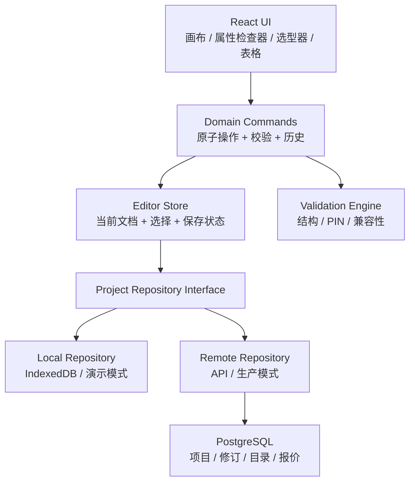

# 线束设计系统现状分析、优化方案与 AI 实施 Prompt

> 文档日期：2026-06-29  
> 分析对象：`wire-harness-designer` 当前工作区  
> 分析方法：源码审查、生产构建、ESLint 检查、1280×720 与 1024×768 浏览器实际操作走查  
> 文档用途：产品评审、技术评审，也可直接把第 12 章交给 AI 编码代理执行

---

## 1. 执行摘要

### 1.1 总体结论

当前系统是一个完成度较高的前端交互原型，但还不是可稳定交付客户使用的生产系统。

它已经具备项目列表、项目向导、线束画布、连接器与导线展示、局部参数编辑、简易报价、BOM 导出和伪 3D 预览等演示能力；但核心设计流程没有形成完整闭环，并存在项目数据串用、保存可靠性不足、关系数据失配、无撤销恢复、伪登录不安全等问题。

最重要的判断如下：

| 问题 | 判断 | 严重度 | 说明 |
|---|---|---:|---|
| 当前系统操作逻辑存在问题 | **存在，且不止一处** | P0 | 空白项目无法继续、选中状态混用、部分 Tab 点击无效、画布删除与业务数据不同步 |
| 修改参数需删除重建，无法直接编辑 | **部分成立** | P0/P1 | 少量参数可编辑，但编辑入口分散且字段不完整；端点、PIN、线长、连接名称等常用修改没有统一闭环 |
| 右键菜单功能受限，选型不便 | **问题比描述更严重** | P1 | 当前代码没有实现任何画布、节点或连线右键菜单；选型只是 32 个静态项的原生下拉框 |
| 需优化交互提升客户体验 | **必须优化** | P0/P1 | 缺少新增入口、撤销、保存状态、批量操作、快捷键、响应式布局、可访问性和明确反馈 |
| 是否还有其他问题 | **有** | P0-P2 | 数据一致性、项目隔离、登录安全、领域模型、报价可信度、测试与文档均存在缺口 |
| 是否需要修改技术栈 | **不建议整体重写** | — | React + TypeScript + Vite + React Flow 可以保留；需要补齐数据校验、历史记录、持久化抽象、测试和生产后端 |

### 1.2 一句话建议

不要先换框架，也不要只做 UI 美化。应先修复“设计流程不可完成”和“数据可能损坏/串项目”的 P0 问题，再统一属性编辑、选型器、右键菜单和撤销机制，最后决定是否接入生产后端、真实报价与订单系统。

---

## 2. 当前系统盘点

### 2.1 当前技术栈

| 层级 | 当前方案 | 判断 |
|---|---|---|
| UI 框架 | React 19 + TypeScript 6 | 现代且足够，无需替换 |
| 构建 | Vite 8 | 合适，无需替换 |
| 样式 | Tailwind CSS 4 | 合适，但缺少设计令牌和组件规范 |
| 画布 | `@xyflow/react` 12 | 很适合节点/连线编辑，应保留 |
| 状态 | Zustand 5 + persist | 小型原型够用，需重构领域动作和持久化边界 |
| 3D 依赖 | Three、React Three Fiber、Drei | 已安装但当前实际预览是 SVG 等距投影，依赖基本未使用 |
| 数据存储 | 浏览器 `localStorage` | 仅适合单机演示，不适合生产 |
| 登录 | 本地 Zustand + 明文密码 | 仅为演示代码，生产不可用 |
| 测试 | 无 | 不可接受 |
| 文档 | 默认 Vite README | 与项目实际功能不符 |

### 2.2 当前主要模块

- `src/App.tsx`：页面状态、项目打开、3 秒轮询保存。
- `src/stores/harnessStore.ts`：线束配置、节点、连接、导线与选择状态。
- `src/stores/projectStore.ts`：项目元数据和项目配置的 `localStorage` 保存。
- `src/stores/userStore.ts`：本地用户和明文密码。
- `src/components/canvas/*`：React Flow 画布、连接器节点和连接标签。
- `src/components/panels/*`：配置、接线矩阵、导线表、报价和 BOM。
- `src/components/project/*`：项目列表和四步创建向导。
- `src/components/preview3d/*`：SVG 等距投影预览，并非真实 3D。

### 2.3 实际质量检查结果

| 检查 | 结果 |
|---|---|
| `npm run build` | 通过 |
| 构建产物 | 主 JS 约 484.09 kB，gzip 约 143.29 kB |
| `npm run lint` | **失败：7 个错误、2 个警告** |
| 自动化测试 | 未发现单元、组件或 E2E 测试 |
| 浏览器主流程 | 可注册、创建模板项目、打开设计器 |
| 空白项目流程 | **失败：没有新增节点入口，无法继续设计** |
| 右键菜单 | **未实现** |
| 小屏体验 | 1024 宽度已明显拥挤；更小屏幕基本不可用 |

---

## 3. 对用户提出问题的逐项核验

## 3.1 “当前系统操作逻辑存在问题”

结论：**成立，而且包含 P0 级流程中断与数据问题。**

### 问题 A：空白项目是不可继续的死路

创建向导明确显示：

> “空白项目无需预设连接器”  
> “进入设计器后手动添加”

证据：`src/components/project/ProjectWizard.tsx:405-406`。

但进入设计器后，画布只配置了连接、点击、拖拽和清空选择，没有“添加节点/连接器”入口，也没有右键菜单：

- `src/components/canvas/HarnessCanvas.tsx:138-143`
- 设计器工具栏中也没有新增按钮。

实际浏览器走查结果是：空白画布只能缩放、平移，无法添加第一个连接器。

这是最高优先级缺陷，因为系统主动提供了一个必然失败的创建路径。

### 问题 B：选择状态概念混用

`selectedWireId` 同时被当作“连接 ID”和“导线 ID”使用：

- 点击画布连线时写入连接 ID。
- `ConnectorPinView` 点击具体导线时写入导线 ID。
- `ConfigPanel` 却先拿它查找连接，再从连接中取第一根导线。

证据：

- `src/components/panels/ConfigPanel.tsx:17-22`
- `src/components/panels/ConnectorPinView.tsx:193-196`
- `src/components/canvas/HarnessCanvas.tsx:109-116`

更明显的是，旧导线编辑器的显示条件是：

```tsx
selectedWire && !selectedConnection
```

但 `selectedWire` 只有在 `selectedConnection` 存在时才会被计算出来，所以该条件在逻辑上不可达。

证据：`src/components/panels/ConfigPanel.tsx:19-22`、`:126`。

结果：

- 点击不同对象后左侧面板行为不稳定。
- 某些点击看起来没有响应。
- 后续很难安全扩展多选、快捷键和右键菜单。

### 问题 C：连接被选中后，“导线列表”Tab 点击无效

当存在 `selectedConnection` 时，`effectiveTab` 会把 `wireList` 和 `wireTable` 强制改为 `pinMatrix`：

证据：`src/components/panels/ConfigPanel.tsx:25-30`。

因此用户点击“导线列表”只修改了 `activeTab`，界面仍然显示连接矩阵。用户必须先点击画布空白处清除选择，才能回到导线列表，但界面没有提示这种规则。

这是典型的“控件可点击但没有可见结果”问题。

### 问题 D：画布本地状态与业务 Store 不同步

React Flow 使用 `onNodesChange`、`onEdgesChange` 修改组件本地数组，但没有实现：

- `onNodesDelete`
- `onEdgesDelete`
- 删除后同步调用 `removeNode` / `removeConnection`

同时每当 Store 变化，又会用 `config.nodes` 和 `config.connections` 重建画布数组。

结果可能是：

- 用户通过 React Flow 默认键盘删除后，元素暂时消失但数据仍在。
- 下一次配置更新后，元素重新出现。
- 画布视觉状态与报价/BOM 所用业务数据不一致。

### 问题 E：无法新增、删除、复制节点和连接

Store 中虽然存在 `addNode`、`removeNode`、`removeConnection`，但主设计器没有对应的可见操作入口。模板创建之后，拓扑结构基本被锁死，只能拖位置或从现有节点句柄拉新连接。

这意味着当前系统更像“查看和微调模板”，不是完整的线束设计器。

### 问题 F：连接建立规则过于隐式

从一个节点拖到另一个节点会自动：

- 创建一条名为“新线缆束”的连接。
- 默认创建一根 `W1`。
- 默认使用两端 Pin 1。
- 默认 26 AWG、硅胶、红色、300 mm。

证据：`src/components/canvas/HarnessCanvas.tsx:59-96`。

没有确认步骤，也不检查：

- 是否已经有相同节点间的连接。
- Pin 1 是否已占用。
- 两端连接器是否兼容。
- 默认线规是否满足电流。
- 用户是否只想建立空连接，而不是自动添加导线。

### 问题 G：全局 Header 存在两套实现但仅一套使用

`src/components/layout/Header.tsx` 包含 JSON 导出和重置功能、显示 v1.0，但 `App.tsx` 自己实现了 v2.0 Header，前者未挂载。

结果是：

- 用户看不到 JSON 导出与重置。
- 存在死代码和版本展示不一致。
- 开发者可能误以为功能已经交付。

---

## 3.2 “修改参数需删除重建，无法直接编辑”

结论：**不是所有参数都不能编辑，但用户感受基本成立。**

### 当前可以编辑的内容

- 设计名称。
- 选中节点后的连接器型号和节点标签。
- 连接矩阵中的线规、线材、线色、信号名。
- 全局接线表中的线规、线材、线色、信号名、线长。
- 报价数量、交期和全局保护套。

### 当前缺少统一直接编辑的内容

- 连接名称。
- 连接起点与终点。
- 单根导线的起点连接器和终点连接器。
- 常用连接矩阵中的起端 PIN、终端 PIN。
- 常用连接矩阵中的线长、导线名称、屏蔽属性。
- 节点类型、连接器方向、配套端子、密封件等工程参数。
- 多根导线的完整批量编辑。

### 为什么会形成“只能删掉重建”的体验

1. 编辑入口被分散到连接矩阵、全局接线表、节点详情和不可达旧编辑器。
2. 同一根导线在不同面板可编辑的字段不同。
3. 画布上的对象没有双击编辑、属性面板或右键编辑。
4. 修改连接器型号时，没有 PIN 迁移/冲突处理流程。
5. 没有“重新指定端点/PIN”的安全操作。
6. 没有撤销，用户不敢尝试修改。

### 直接编辑不能只改 UI

如果把所有字段直接变成输入框，而不增加领域校验，会制造更严重的数据损坏。

例如，当前 `updateNode` 允许把 6P 连接器直接换成 2P，但不会检查原导线是否还连接到 Pin 3-6。这样会得到“界面是 2P、数据仍引用 Pin 6”的非法配置。

正确方案应包含：

1. 统一属性检查器。
2. 草稿态编辑和“应用/取消”。
3. 实时字段校验。
4. 连接器变更影响分析。
5. 保留有效映射、手动重映射无效 PIN、取消三种选择。
6. 一个原子事务提交全部关联修改。
7. 可撤销。

---

## 3.3 “右键菜单功能受限，选型不便”

结论：**当前不是“受限”，而是没有实现右键菜单。**

源码中未发现 `onContextMenu`，React Flow 也没有配置：

- `onNodeContextMenu`
- `onEdgeContextMenu`
- `onPaneContextMenu`

因此右键只能触发浏览器默认菜单。

### 建议的右键菜单

右键菜单必须是快捷入口，同时保留可见工具栏/属性面板作为键盘与触屏替代，不能把关键功能只藏在右键里。

#### 画布空白处

- 添加连接器。
- 添加接线端子。
- 添加接点/分支点。
- 粘贴。
- 全选。
- 自动布局。
- 适配画布。

#### 节点

- 编辑属性。
- 更换连接器型号。
- 发起连接。
- 复制节点。
- 复制/粘贴 PIN 映射。
- 查看相关导线。
- 删除节点。

#### 连接

- 编辑连接名称与保护方式。
- 添加导线。
- 批量编辑连接内导线。
- 复制导线配置。
- 反转连接方向。
- 删除连接。

#### 单根导线

- 编辑完整参数。
- 重映射 PIN。
- 复制。
- 反转起终端。
- 删除。

### 当前选型器的问题

当前连接器选择只是一个包含约 32 项的原生 `<select>`：

- 无搜索。
- 无制造商、系列、Pin 数、间距、性别、类别筛选。
- 无料号和图片。
- 无兼容端子、线径范围和额定信息。
- 无最近使用、收藏和自定义物料。
- 项目向导和属性面板重复使用同一长下拉框。

连接器数据本身也只是静态前端数组，无法满足真实生产选型。

建议改成统一 `PartPickerDialog`：

- 顶部全文搜索。
- 左侧多条件筛选。
- 中间虚拟列表/结果表。
- 右侧详情预览。
- 最近使用与收藏。
- 明确“应用”操作。
- 支持新增自定义料号，但自定义项要有来源和版本标记。

---

## 3.4 “需优化交互以提升客户体验”

结论：**必须优化，且应围绕完整任务流，而不是零散美化。**

### 推荐的主工作流


### 推荐的设计器布局

- 顶部：项目名、保存状态、撤销/重做、导入/导出、校验、提交询价。
- 左侧：物料库/项目结构树，可折叠。
- 中间：画布。
- 右侧：统一属性检查器，可折叠和调宽。
- 底部可选：接线表、问题列表、BOM。
- 3D/等距预览改为可开关面板，不应永久覆盖画布。

### 必须增加的反馈

- `已保存 / 正在保存 / 保存失败 / 本地离线` 状态。
- 操作成功 Toast。
- 删除后的撤销 Toast。
- 非法配置就地错误提示。
- 项目存在未保存修改时的离开提示。
- 空状态提供明确主按钮。
- 无动作按钮禁用并说明原因，不能保留“看起来可用”的假按钮。

---

## 4. 其他已发现问题

## 4.1 P0：项目数据隔离与保存存在风险

### 风险 A：同一配置被保存两份

线束配置同时存在于：

- Zustand `harness-config` 持久化数据。
- `harness-project-config-{projectId}` 项目数据。

这形成两个真相源，容易出现一个更新、另一个未更新。

### 风险 B：`setConfig` 是合并，不是真正替换

`setConfig` 使用：

```ts
config: { ...state.config, ...updates }
```

证据：`src/stores/harnessStore.ts:187-190`。

打开另一个项目或创建新项目时传入完整配置，看起来像替换，实际上旧项目中存在、而新项目缺失的可选字段会残留。例如旧项目有 `protection` 或 `bundles`，新项目没有这些键，它们可能被带入新项目。

需要拆成：

- `patchConfig(partial)`：局部修改。
- `replaceConfig(fullConfig)`：加载/切换项目，完整替换并校验。

### 风险 C：项目配置加载失败时沿用上一个项目

`App.tsx` 打开项目时只有 `loadProjectConfig` 返回非空才调用 `setConfig`，但无论成功与否都会进入设计器。

证据：`src/App.tsx:79-87`。

如果项目配置缺失或 JSON 损坏，用户可能在项目 B 的标题下编辑项目 A 的数据。

### 风险 D：3 秒轮询保存不可靠

当前保存是固定 3 秒间隔：

证据：`src/App.tsx:60-69`。

问题包括：

- 页面关闭前最后 3 秒的修改可能未写入项目配置。
- 没有保存失败反馈。
- 没有 `beforeunload` 保护。
- 无变更时仍重复序列化和写入。
- `localStorage.setItem` 异常未捕获。
- 项目 `updatedAt` 不随配置保存更新，项目列表的“更新于”不真实。

建议改为基于变更的防抖保存，并有显式状态机：

`idle → dirty → saving → saved / error`。

## 4.2 P0：关系数据可以失配

当前连接和导线之间存在双向冗余：

- `Connection.wireIds`
- `Wire.fromConnectorId / toConnectorId`

但 Store 的基础动作没有统一维护关系：

- `addWire` 只把 Wire 放入数组，不自动加入 Connection。
- `removeConnection` 只删除 Connection，不删除或解绑关联 Wire。
- 某些组件自行调用多个 Store 动作来补关系。

证据：

- `src/stores/harnessStore.ts:249-256`
- `src/stores/harnessStore.ts:259-266`
- `src/components/panels/PinMatrixPanel.tsx:196-202`
- `src/components/panels/ConnectorPinView.tsx:131-155`

多组件自行拼事务，会产生孤儿导线、悬空引用或部分提交。

必须把关联操作收口为领域命令，例如：

- `addWireToConnection(connectionId, wireDraft)`
- `removeWire(wireId)`
- `removeConnection(connectionId, policy)`
- `changeConnectorPart(nodeId, newPartId, pinMapping)`
- `reassignWireRoute(wireId, route)`

每个命令一次性完成所有关联修改并运行校验。

## 4.3 P0：本地登录不安全

密码以明文保存在 `localStorage`：

证据：`src/stores/userStore.ts:28-39`、`:50-70`。

此外“切换用户”不要求再次验证密码，不能视为权限隔离。所有项目数据均可由同一浏览器脚本读取。

生产方案必须使用服务端身份认证、安全 Cookie/令牌、服务端授权和用户级数据隔离。

在没有后端前，界面应明确标记为“本地演示模式”，不要把它包装成真实账号系统。也可以暂时移除密码字段，避免形成虚假安全感。

## 4.4 P0：报价和下单能力具有误导性

- 单价规则硬编码在前端。
- 货币固定显示 `$`，但没有币种、税费、运费、阶梯报价版本。
- 没有端子、密封塞、外壳、热缩管长度、损耗、测试等真实成本。
- “加入购物车”按钮没有 `onClick`，点击无任何动作。

证据：`src/components/panels/QuotePanel.tsx:55-57`。

建议：

- 若暂无真实交易流程，将按钮改为“导出估算”或“提交询价”并标注“估算价”。
- 若要正式报价，价格必须来自后端版本化规则，并记录报价快照。
- 无后端时不可伪造购物车成功。

## 4.5 P1：领域模型不足以支持真实线束制造

当前模型适合展示 Pin-to-Pin 连接，但缺少：

- 连接器制造商料号、版本、生命周期。
- Housing、Terminal、Seal、TPA、Backshell 等配套物料。
- 端子适用线径和压接规则。
- 接点、拼接、焊点和多端网络。
- 双绞、同轴、屏蔽层、排流线。
- 每个线段独立的保护套、胶带、标签和分支长度。
- 线长公差、剥线长度、压接高度、测试要求。
- 连接器方向、视图方向、腔位定义。
- 设计版本、修订、审核、冻结和变更单。

`HarnessNode` 声明了 `junction` 和 `terminal`，但画布只注册 `connector` 节点：

- `src/types/harness.ts:77-84`
- `src/components/canvas/HarnessCanvas.tsx:21`

`WireBundle` 也没有与具体导线建立可靠关联，只在 BOM 中被单独读取。

## 4.6 P1：连接器目录数据不够可信

目录目前是写死在 `src/lib/data.ts` 的演示数据。

例如 USB Type-C 条目声明 `pinCount: 16`，但 `pinLabels` 实际有 17 个值，而且真实 Type-C 连接器定义也不能用这组简化数据直接指导生产。

证据：`src/lib/data.ts:45`。

目录至少需要：

- 稳定料号 ID。
- 制造商、系列、描述、数据表链接。
- 腔位数量与标签一致性校验。
- 配套端子和适用线规。
- 版本和启停状态。
- 自定义物料与官方物料区分。

## 4.7 P1：缺少设计规则校验

当前没有统一 `validateHarness`，因此可以产生：

- PIN 越界。
- 节点或连接不存在。
- Connection 引用不存在的 Wire。
- Wire 不属于 Connection 两端节点。
- 非法长度、数量或空名称。
- 不支持的线规/端子组合。
- 同一 PIN 非预期重复占用。
- 空 Connection 和孤儿 Wire。

建议建立纯函数校验器，输出：

```ts
type ValidationIssue = {
  id: string;
  severity: 'error' | 'warning' | 'info';
  code: string;
  entity: { kind: 'project' | 'node' | 'connection' | 'wire'; id?: string };
  message: string;
  suggestedAction?: string;
};
```

保存可以允许 Warning，但正式导出/提交询价前必须阻止 Error。

## 4.8 P1：缺少撤销/重做和安全删除

- 删除导线立即执行。
- 没有删除确认或撤销。
- 没有 `Ctrl/Cmd+Z`、`Ctrl/Cmd+Shift+Z`。
- 没有操作历史。
- 项目删除使用原生 `window.confirm`，体验和样式不一致。

设计工具中，撤销/重做属于基础能力，不是锦上添花。

## 4.9 P1：响应式和可访问性不足

### 响应式

左右栏宽度固定为 320px 和 288px：

证据：`src/components/layout/MainLayout.tsx:13-15`。

1024 宽度下画布已经很窄；平板和手机几乎不可操作。

建议：

- 桌面端左右栏可折叠、可调整宽度。
- 1024 以下默认折叠一侧。
- 768 以下进入“表格/查看模式”，或明确提示建议使用桌面端。
- 3D 预览可关闭、可停靠，不覆盖关键画布区域。

### 可访问性

- 多个 `div onClick` 没有按钮语义和键盘行为。
- 多个图标按钮缺少可访问名称。
- 多处依赖 hover 才显示编辑/删除按钮，触屏不可发现。
- 大量 10px 字号。
- 颜色选择主要依赖颜色本身。
- 弹窗无焦点锁定、Esc 关闭和焦点恢复。
- 标签与表单控件未系统关联。

## 4.10 P1：所谓“3D 预览”并不是真实 3D

当前 `Preview3D` 使用 SVG 等距投影绘制盒子和二次贝塞尔线，不使用真实连接器模型，也不根据线长计算空间路径。

已安装的 Three / React Three Fiber / Drei 没有参与这套预览。

这会带来两个选择：

1. 如果客户只需要拓扑辅助，改名为“等距预览/空间示意”，移除未使用 3D 依赖。
2. 如果客户需要真实 3D，明确需求后再引入连接器模型、线束路径、尺寸和相机交互。

不建议保留“假 3D + 重 3D 依赖”的中间状态。

空项目时 `Math.min(...[])` / `Math.max(...[])` 还会生成非有限计算值：

证据：`src/components/preview3d/Preview3D.tsx:20-24`、`:50-54`。

应对空数组显式渲染空状态。

## 4.11 P1：工程质量不足

- ESLint 当前失败：7 个 `any` 错误、2 个 Hook 依赖警告。
- `PinMatrixPanel.tsx` 约 993 行，职责过重。
- 同一种导线编辑表单至少有多套实现，字段不一致。
- 存在遗留 `branch` 别名和未使用组件/依赖。
- README 仍是 Vite 模板。
- 无 Error Boundary。
- 无数据迁移和运行时 schema 校验。
- 无测试。
- 多处重复 `Math.random` ID 生成器，应统一使用 `crypto.randomUUID()`。

## 4.12 P2：BOM 与业务表达仍需完善

- BOM 是单套线束物料还是订单总物料不明确。
- BOM 数量未乘订单数量，界面也未说明“单套用量”。
- 线材按精确切线长度分组，但未计损耗。
- 缺少端子、密封件、标签、保护材料长度等。
- 描述使用内部英文 ID，如 `silicone`、`red`。
- BOM 总计与报价总价口径不同但没有说明。
- Excel 导出实际是 TSV 伪装成 `.xls`，不是标准 XLSX。

---

## 5. 技术栈是否需要修改

## 5.1 建议保留

- React 19。
- TypeScript。
- Vite。
- Tailwind CSS。
- React Flow。
- Zustand，但只保留为 UI/领域状态容器，不直接承担全部持久化职责。

这些技术足以支撑当前产品，不存在必须迁移到 Vue、Angular、Next.js 或桌面框架的理由。整体重写会增加风险，却不会自动解决领域模型和数据一致性。

## 5.2 建议新增或调整

| 能力 | 建议 |
|---|---|
| 运行时数据校验 | 增加 Zod 或同类 schema，配置必须带 `schemaVersion` |
| 撤销/重做 | 自建命令历史或使用兼容 Zustand 的 temporal/history 方案 |
| 本地持久化 | 用 Repository 接口隔离；中期可由 IndexedDB 实现，避免大对象直接塞 `localStorage` |
| 表单 | 可选 React Hook Form + Zod；至少统一草稿、校验、提交模式 |
| 组件测试 | Vitest + React Testing Library |
| E2E | Playwright |
| 错误监控 | 生产阶段接入异常监控 |
| 后端 | 生产阶段增加 API、数据库、认证、对象存储、审计日志 |

## 5.3 生产后端建议

如果目标是多用户、跨设备、可报价、可下单的客户系统，必须增加服务端。

技术选择可以是：

- TypeScript 团队：NestJS/Fastify + PostgreSQL。
- 追求快速上线：成熟 BaaS + PostgreSQL，但仍要做服务端授权和价格规则。

后端至少负责：

- 用户认证和授权。
- 项目与修订持久化。
- 连接器目录。
- 报价规则及报价快照。
- 文件导出记录。
- 审计日志。
- 可选协作锁/冲突控制。

前端不应自行保存真实密码或决定最终价格。

## 5.4 关于 3D 栈

当前阶段建议先把它改名为“等距预览”，并移除未使用的 Three 相关依赖。

只有在明确需要以下能力时才保留/启用 React Three Fiber：

- 连接器真实模型。
- 可测量的 3D 布线路径。
- 分支空间坐标和长度联动。
- 旋转、剖视、碰撞或装配验证。

---

## 6. 推荐目标架构



### 6.1 状态必须分层

不要再用一个 `selectedWireId` 表达多种对象。

建议：

```ts
type Selection =
  | { kind: 'none' }
  | { kind: 'node'; id: string }
  | { kind: 'connection'; id: string }
  | { kind: 'wire'; id: string }
  | { kind: 'multi'; items: Array<{ kind: 'node' | 'connection' | 'wire'; id: string }> };
```

编辑文档状态、UI 状态、保存状态也应分开：

```ts
type SaveState =
  | { status: 'saved'; savedAt: number }
  | { status: 'dirty' }
  | { status: 'saving' }
  | { status: 'error'; message: string };
```

### 6.2 单一数据真相源

- 当前打开项目在 Editor Store 中只有一份。
- 项目保存通过 Repository 写入。
- 不再同时持久化全局 `harness-config` 和项目配置。
- 切换项目必须 `replaceDocument`，不能 merge。
- UI 选择、弹窗、Tab 不持久化到项目文档。

### 6.3 原子领域命令

所有复杂操作必须由一个命令完成，而不是组件连续调用多个 Store action。

```ts
addConnectorNode(input)
updateNodeProperties(nodeId, patch)
changeConnectorPart(nodeId, newPartId, pinMigration)
createConnection(input)
updateConnection(connectionId, patch)
addWireToConnection(connectionId, wire)
updateWire(wireId, patch)
reassignWireRoute(wireId, route)
removeWire(wireId)
removeConnection(connectionId, policy)
removeNode(nodeId, policy)
duplicateSelection()
undo()
redo()
```

每个命令都应：

1. 校验输入。
2. 在内存中生成完整下一状态。
3. 保证无悬空引用。
4. 一次提交。
5. 记录历史。
6. 标记 `dirty`。

---

## 7. 优先级和建议迭代计划

## Phase 0：阻断性修复（先完成）

目标：不再出现死路、串项目和明显数据损坏。

- 空白项目增加连接器节点入口。
- 拆分 `patchConfig` / `replaceConfig`。
- 修复项目加载失败仍进入设计器。
- 重构 Selection 类型。
- 修复 Tab 点击无效。
- 画布删除与 Store 同步，或暂时禁用默认删除。
- 收口连接/导线的原子领域动作。
- 增加基础结构校验。
- 空 3D 预览安全处理。
- 移除或禁用无动作“加入购物车”。
- ESLint 零错误。
- 为上述缺陷补自动化测试。

预计：2-5 个有效开发日，取决于测试覆盖深度。

## Phase 1：核心编辑体验

- 顶部命令栏。
- 统一属性检查器。
- 完整导线编辑。
- 连接器变更影响与 PIN 重映射。
- 画布/节点/连接/导线右键菜单。
- 可搜索筛选的连接器选型器。
- 新增、复制、删除节点和连接。
- Undo/Redo。
- 保存状态与错误反馈。
- 可折叠/可调宽侧栏。
- 快捷键与基本可访问性。

预计：5-10 个有效开发日。

## Phase 2：领域与数据完善

- `schemaVersion`、Zod schema 和迁移。
- Project Repository 抽象。
- IndexedDB 本地仓库。
- 连接器/端子/密封件目录模型。
- 接点、分支、屏蔽、双绞和保护段模型。
- 设计规则校验面板。
- 标准 XLSX/JSON/PDF 导出。
- 修订和快照。

预计：10-20 个有效开发日。

## Phase 3：生产化

- 后端认证和授权。
- PostgreSQL 持久化。
- 服务端物料目录。
- 真实报价规则和报价快照。
- 询价/订单工作流。
- 审计、监控、备份和恢复。
- 多人协作或编辑锁。

预计：需要单独需求分析，不应由前端原型直接推断。

---

## 8. 建议的数据模型方向

以下是方向性模型，不要求第一轮全部实现：

```ts
interface HarnessDocument {
  schemaVersion: number;
  id: string;
  projectId: string;
  revision: string;
  name: string;
  unitSystem: 'metric' | 'imperial';
  nodes: HarnessNode[];
  connections: HarnessConnection[];
  wires: HarnessWire[];
  protectionSegments: ProtectionSegment[];
  metadata: {
    createdAt: string;
    updatedAt: string;
    createdBy?: string;
    note?: string;
  };
}

interface ConnectorInstance {
  catalogPartId: string;
  catalogRevision: string;
  displayName: string;
  orientation?: string;
  pinOverrides?: Record<string, string>;
}

interface HarnessWire {
  id: string;
  connectionId: string;
  name: string;
  signalName?: string;
  from: { nodeId: string; cavityId: string };
  to: { nodeId: string; cavityId: string };
  specification: {
    wireTypeId: string;
    gauge: { system: 'AWG' | 'mm2'; value: number };
    colorId: string;
    lengthMm: number;
    lengthToleranceMm?: number;
    shielded?: boolean;
  };
}
```

关键点：

- Wire 直接持有 `connectionId`，避免另一个数组维护 `wireIds`；或者只保留 `Connection.wireIds`，二选一。
- 连接器实例只引用目录料号和版本，不把整份目录对象复制进每个项目。
- PIN 使用稳定 cavity ID，而不是仅用数组序号。
- 时间使用 ISO 字符串或有明确序列化规范。

---

## 9. 关键验收场景

以下场景应被自动化测试覆盖。

### 9.1 空白项目

1. 创建空白项目。
2. 进入设计器可看到“添加连接器”主按钮。
3. 添加两个连接器。
4. 建立连接并添加导线。
5. 刷新页面后数据仍在。

### 9.2 完整直接编辑

1. 选中一根导线。
2. 在同一属性检查器中修改名称、信号、线规、线材、颜色、长度、屏蔽、起终点和 PIN。
3. 应用后画布、接线表、BOM、报价同步更新。
4. 不需要删除重建。

### 9.3 连接器变更

1. 6P 连接器已有 Pin 1-6 导线。
2. 尝试改为 2P。
3. 系统显示 4 根受影响导线。
4. 未明确选择重映射/移除/取消前，不改变数据。
5. 不允许静默产生 Pin 越界。

### 9.4 删除与撤销

1. 删除一条 Connection。
2. 系统明确说明关联 Wire 的处理策略。
3. 删除后无孤儿引用。
4. `Ctrl/Cmd+Z` 完整恢复。

### 9.5 项目隔离

1. 项目 A 选择保护套并添加节点。
2. 打开无保护套的项目 B。
3. B 不继承 A 的任何可选字段。
4. B 配置损坏时，不得显示 A 的数据；应进入恢复/错误页面。

### 9.6 保存

1. 任意修改后显示“未保存/正在保存”。
2. 保存成功显示时间。
3. 模拟写入失败，显示可重试错误。
4. 快速修改后立即返回项目列表，不丢失最后一次修改。

### 9.7 右键与键盘

1. 右键画布、节点、连接分别显示对应菜单。
2. Esc 关闭菜单。
3. 键盘用户可以通过命令栏完成同样操作。
4. 触屏用户不依赖右键。

### 9.8 校验

非法 PIN、悬空引用、负长度、空节点引用等均能被检测，错误项可以定位到画布实体。

---

## 10. 不建议做的事情

- 不要为了“现代化”整体迁移到另一个前端框架。
- 不要只增加右键菜单而不增加可见替代入口。
- 不要把字段都改成输入框却忽略关联数据迁移。
- 不要继续在多个组件中手动组合 `addWire + updateConnection`。
- 不要继续维护两份项目配置。
- 不要在前端硬编码并宣称为正式报价。
- 不要用 `localStorage` 明文密码作为真实登录。
- 不要先投入真实 3D，除非客户需求明确。
- 暂不实现3D
- 不要在没有测试的情况下大规模重写 993 行的核心面板。

---

## 11. 推荐最终产品指标

| 指标 | 目标 |
|---|---|
| 首次创建可完成率 | 空白/模板项目均 100% 可进入完整设计闭环 |
| 常用参数修改 | 不删除对象即可完成 |
| 撤销 | 所有结构性编辑均可撤销/重做 |
| 数据完整性 | 保存前 0 个悬空引用、0 个非法 PIN |
| 保存反馈 | 任何时刻可知保存状态 |
| 项目隔离 | 自动化测试覆盖，不串项目 |
| Lint/Typecheck/Build | 全部通过 |
| 自动化测试 | 领域命令、迁移、核心组件、主流程均覆盖 |
| 可访问性 | 关键流程键盘可操作，不依赖颜色/hover/右键 |
| 小屏 | 1024 宽可用；更小屏有明确降级策略 |

---

# 12. 可直接交给 AI 的详细实施 Prompt

下面整段可直接复制给具备仓库读写和终端能力的 AI 编码代理。

```text
你正在修改一个线束设计器仓库。请先完整阅读：

1. SYSTEM_ANALYSIS_AND_IMPLEMENTATION_PROMPT.md
2. package.json
3. src/types/harness.ts
4. src/stores/harnessStore.ts
5. src/stores/projectStore.ts
6. src/App.tsx
7. src/components/canvas/*
8. src/components/panels/*
9. src/components/project/*

目标不是重新换皮，而是把当前“演示原型”改造成数据安全、操作闭环、可继续迭代的线束编辑器。

## 总体约束

- 保留 React + TypeScript + Vite + Tailwind + React Flow + Zustand，不要迁移框架。
- 不要删除或覆盖用户已有改动；先检查 git status 和 diff。
- 不要执行 git reset --hard、checkout 覆盖、清理整个工作区等破坏性操作。
- 不要伪造后端、支付、购物车、真实报价或认证成功。
- 所有关系修改必须通过领域命令原子完成，不允许组件继续手动串联多个低级 Store action。
- 所有复杂删除必须无悬空引用，并可撤销。
- 关键功能同时提供可见按钮和右键快捷入口，不能只支持右键。
- 每完成一个小阶段就运行 lint、typecheck/build 和相关测试，不要积累到最后。
- 如果依赖安装受限，先完成无新依赖可实现的部分，并清楚记录待安装项；不要跳过验证。

## 实施范围与顺序

按以下顺序实施 Phase 0 和 Phase 1。Phase 2 只做 schema/repository 基础，不接入外部服务。不要在这次任务中实现生产后端。

### Step 1：建立测试基线

- 增加 Vitest + React Testing Library。
- 增加 Playwright E2E；如果环境暂时无法安装浏览器，至少提交配置和可运行测试代码。
- 为项目隔离、空白项目、领域级增删改、连接器降 Pin 数、保存状态建立失败测试。
- 保留当前可工作的模板创建、BOM、报价计算行为。

### Step 2：修复类型和选择模型

把 selectedNodeId / selectedWireId 的混用替换为明确 Selection：

type Selection =
  | { kind: 'none' }
  | { kind: 'node'; id: string }
  | { kind: 'connection'; id: string }
  | { kind: 'wire'; id: string };

要求：

- 节点点击选 node。
- 连接点击选 connection。
- 导线列表和 PIN 视图可以选具体 wire。
- ConfigPanel 根据 selection.kind 显示正确属性。
- 用户点击“导线列表”时必须真的切换，不得被 effectiveTab 强制覆盖。
- 删除当前选中对象后 selection 自动回到 none。
- 不要持久化 Selection。

### Step 3：建立单一文档真相源

- 将 setConfig 拆为 patchDocument 和 replaceDocument。
- patchDocument 只用于局部字段修改。
- replaceDocument 用于打开/创建/恢复项目，必须完整替换，绝不能 merge 旧项目的可选字段。
- 移除 harness-config 与 project config 的双重持久化；Editor Store 不再单独 persist 整份当前文档。
- 项目打开失败或 schema 校验失败时，显示错误/恢复界面，不能沿用上一个项目。
- 保存后更新项目 updatedAt。
- 保存采用基于修改的 debounce，而不是固定每 3 秒轮询。
- 增加 saveState：saved、dirty、saving、error，并在 Header 可见。
- 返回项目列表、刷新或关闭前安全 flush；失败时给用户明确提示。

先定义 ProjectRepository 接口：

interface ProjectRepository {
  load(projectId: string): Promise<HarnessDocument>;
  save(projectId: string, document: HarnessDocument): Promise<void>;
  remove(projectId: string): Promise<void>;
}

本轮可以先实现兼容现有数据的 LocalProjectRepository。若引入 IndexedDB 会显著扩大修改，可先保留 localStorage adapter，但所有读写必须经过 repository，捕获 quota/parse 错误，并为后续 IndexedDB 留出替换点。

### Step 4：schema、迁移与完整性校验

- 给文档增加 schemaVersion。
- 使用 Zod 或等价运行时 schema 校验持久化数据。
- 为当前无 schemaVersion 的旧数据提供 migration。
- 新建 validateHarness(document) 纯函数。
- 至少检测：
  - 不存在的节点、连接和导线引用。
  - Connection 与 Wire 端点不一致。
  - PIN 小于 1 或超过连接器 pinCount。
  - 空连接、孤儿导线。
  - 非法长度和数量。
  - connector.pinCount 与 pinLabels 明显不一致。
- 将错误显示在可折叠“设计检查”面板；点击问题可选中并定位实体。
- Error 阻止正式导出/提交询价，Warning 不阻止保存。

### Step 5：原子领域命令

实现并测试以下命令，命名可按项目风格调整：

- addConnectorNode
- updateNodeProperties
- changeConnectorPart
- createConnection
- updateConnection
- addWireToConnection
- updateWire
- reassignWireRoute
- removeWire
- removeConnection
- removeNode
- duplicateSelection

要求：

- addWireToConnection 一次性创建 Wire 并维护 Connection 关系。
- removeWire 一次性移除所有反向引用。
- removeConnection 必须显式决定删除关联 Wire 或取消，不得留下孤儿。
- removeNode 必须在对话框中展示将受影响的 Connection 和 Wire 数量。
- changeConnectorPart 在新连接器 Pin 数不足时显示影响分析：
  1. 保留仍合法的映射。
  2. 对非法映射提供手动重映射。
  3. 用户可取消。
  未确认前不得改数据，禁止静默删除或生成越界 PIN。

组件不得直接拼装关系数组。

### Step 6：空白项目和拓扑编辑闭环

- 空白画布显示明显的“添加第一个连接器”按钮。
- 顶部命令栏提供“添加连接器”。
- 支持新增、复制、删除节点。
- 支持新增和删除连接。
- 建立连接后打开配置面板，让用户选择：
  - 创建空连接。
  - 创建默认一根导线。
  - 按可用 PIN 批量创建。
- 默认值可预填但必须可确认，不能无提示强制 Pin 1。
- React Flow 的节点/连线删除必须与领域 Store 同步；如果尚未接管默认删除，先禁用 React Flow 默认删除键，避免视觉与数据不同步。

### Step 7：统一属性检查器

删除不可达的 legacy wire editor，提取可复用表单组件，避免 PinMatrix、WireTable、ConfigPanel 各维护一套不同字段。

右侧或可调整侧栏实现统一 PropertyInspector：

节点：
- 标签。
- 连接器料号。
- 方向/备注（如模型尚未支持可先为可选字段）。

连接：
- 名称。
- 起终节点（修改需校验）。
- 保护方式。
- 导线数量摘要。

导线：
- 名称。
- 信号名。
- 起点节点与 PIN。
- 终点节点与 PIN。
- 线规。
- 线材。
- 颜色。
- 长度。
- 屏蔽。

要求：

- 表单使用 draft 状态，提供“应用/取消”。
- 应用前显示字段和领域校验错误。
- 修改后画布、连接矩阵、接线表、BOM、报价立即一致。
- 不允许 Number('') 变为 0 或 NaN 后直接写入 Store。
- PIN 下拉选项来自当前连接器有效腔位。

### Step 8：连接器选型器

创建统一 PartPickerDialog，项目向导和属性检查器复用。

支持：

- 按名称、制造商、ID/料号搜索。
- 按制造商、Pin 数、间距、类型筛选。
- 显示名称、制造商、Pin 数、间距、类型。
- 详情区显示 PIN 标签和兼容性信息。
- 最近使用。
- 空结果和清除筛选。
- 键盘操作、焦点管理和 Esc 关闭。

不要再把全部连接器塞进长原生 select 作为唯一入口。可以保留小型快速选择，但必须有“浏览全部物料”按钮。

修复 USB Type-C 示例数据的 pinCount/pinLabels 不一致；若数据只是演示，明确标记 demo catalog，禁止把不可靠规格包装成生产数据。

### Step 9：上下文菜单

实现：

画布菜单：
- 添加连接器。
- 粘贴（有剪贴板内容时）。
- 全选。
- 自动布局（若暂不实现则不显示）。
- 适配画布。

节点菜单：
- 编辑。
- 更换型号。
- 发起连接。
- 复制。
- 删除。

连接菜单：
- 编辑。
- 添加导线。
- 批量编辑。
- 删除。

导线菜单（在导线表/矩阵中）：
- 编辑。
- 复制。
- 反转起终端。
- 删除。

要求：

- 菜单位置限制在视口内。
- 点击外部和 Esc 关闭。
- 菜单项根据状态启用/禁用。
- 每个关键操作也能从命令栏或属性检查器完成。
- 不拦截浏览器右键的区域要有明确决定。

### Step 10：Undo/Redo 和安全删除

- 为所有领域命令建立 past/present/future 或命令历史。
- 支持 Ctrl/Cmd+Z 和 Ctrl/Cmd+Shift+Z。
- 顶部提供撤销/重做按钮和可访问名称。
- 连续拖拽节点只记录一个历史步骤。
- 文本输入在点击“应用”时记录一个步骤，不要每个按键记录一次。
- 删除后显示可撤销 Toast。
- 项目切换时清空编辑历史。
- Undo/Redo 后标记 dirty，并正常保存。

### Step 11：交互反馈、布局和可访问性

- Header 显示保存状态、撤销/重做、添加、导入/导出、校验。
- 合并或删除未使用的旧 Header，版本显示只保留一处。
- 3D 预览改名“等距预览”，为空数据提供空状态；暂时移除未使用的 Three/R3F/Drei 依赖，除非你确实把它实现为真实 3D。
- 预览可关闭/停靠，不永久遮挡画布。
- 左右侧栏可折叠，至少保证 1024px 宽度可用。
- 小于 768px 提供清晰降级界面或查看模式，不要挤成不可操作画布。
- hover-only 操作改为始终可发现或在选中后可见。
- 图标按钮增加 aria-label/title。
- 可点击 div 改为 button 或补齐 role、tabIndex、键盘处理。
- 弹窗实现焦点锁定、Esc、关闭后焦点恢复。
- 颜色选项同时显示名称/勾选，不仅靠颜色。
- 避免 10px 作为关键操作文字。

### Step 12：报价、购物车和导出诚实化

- 当前“加入购物车”没有行为。没有真实购物车时：
  - 将其替换为“导出估算”或“提交询价（暂不可用）”。
  - 显示“估算价，非正式报价”。
- 明确货币单位和 BOM/报价口径。
- BOM 标记“单套用量”或“订单总用量”，不要含糊。
- JSON 导入和导出应使用 schemaVersion，并在导入前校验/预览。
- Excel 如输出 TSV，不要伪装为标准 XLSX；要么明确 CSV/TSV，要么使用真正 XLSX 库。

### Step 13：清理与文档

- 修复全部 ESLint 错误和警告。
- 移除 no-explicit-any，使用 React Flow 正确泛型。
- 拆分约 993 行的 PinMatrixPanel。
- 统一 ID 生成器为 crypto.randomUUID() 并提供测试 fallback。
- 删除不再使用的 branch 兼容别名、死组件和未使用依赖，但先用 rg 确认引用。
- 增加 ErrorBoundary。
- 重写 README，包括：
  - 功能范围。
  - 演示模式限制。
  - 安装、开发、构建、测试。
  - 数据存储方式。
  - 架构说明。
  - 后续生产化边界。

## 必须通过的验收测试

1. 创建空白项目后能添加两个连接器、建立连接、添加导线。
2. 一根导线可在统一面板中修改名称、信号、线规、线材、颜色、长度、屏蔽、起终节点和 PIN，无需删除重建。
3. 6P 改 2P 时必须显示受影响映射，不能静默产生非法数据。
4. 删除 Connection 后无孤儿 Wire，撤销可完整恢复。
5. 项目 A 的 protection/bundles 等可选字段不会泄漏到项目 B。
6. 项目 B 配置损坏时不会显示项目 A 数据。
7. 导线列表 Tab 点击后确实显示导线列表。
8. 画布、节点、连接右键菜单内容正确，并有键盘/工具栏替代。
9. 最后一次修改后立即返回项目列表再打开，数据不丢失。
10. 保存失败可见且可重试。
11. 非法 PIN、悬空引用、负长度会出现在校验面板。
12. “加入购物车”不再是无动作假按钮。
13. 1024px 宽度下主流程可操作。
14. npm run lint、npm run build、全部单元/组件/E2E 测试通过。

## 最终交付格式

完成后请提供：

- 改动摘要，按数据安全、编辑体验、右键菜单、保存、测试分类。
- 关键架构决策及原因。
- 修改文件列表。
- 数据迁移说明。
- 运行过的命令和结果。
- 仍未实现或需要后端支持的项目。
- 手工验收步骤。

不要只报告“已优化”。必须给出测试证据，并明确哪些能力仍是演示级。
```

---

## 13. 最终建议

如果只能投入一次短迭代，优先做：

1. 空白项目可新增节点。
2. 单一项目数据源和安全 `replaceDocument`。
3. 选择模型重构。
4. 原子关系操作与结构校验。
5. 统一完整属性编辑。
6. 撤销/重做。
7. 搜索选型器和右键菜单。
8. 保存状态和失败反馈。

技术栈可以继续使用。当前系统真正需要替换的不是 React，而是“组件直接拼业务数据、多个持久化真相源、没有领域校验”的原型式实现方式。
