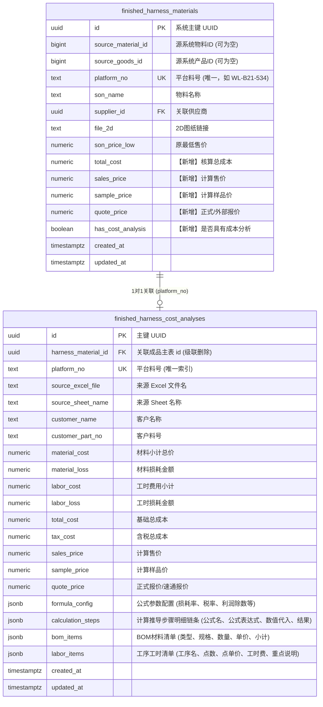
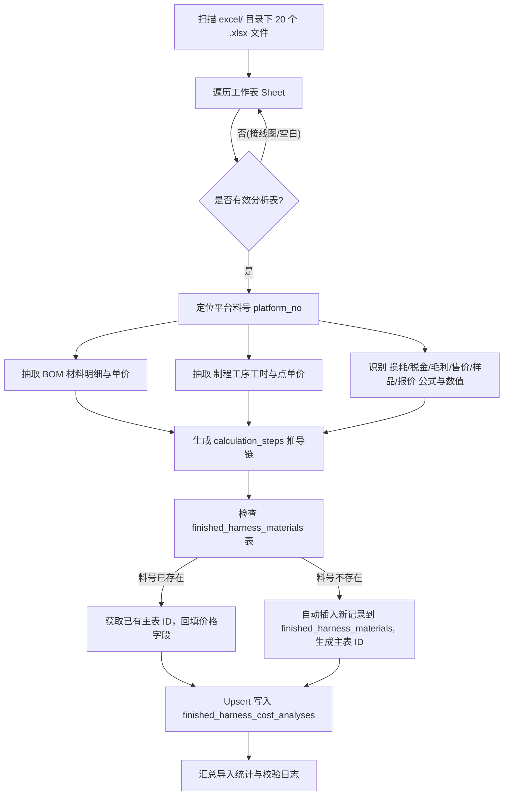

# 成品方案库成本分析与定价公式入库方案

## 一、 背景与业务目标

本项目已在“物料库 - 现有成品线束方案”中维护了成品物料基本信息（表 `finished_harness_materials`），但原有界面的“成本分析”与“报价”仅为占位“暂无”。

在项目根目录 `excel/` 下共有 20 个 Excel 文件（涵盖 40+ 个成品料号），记录了各成品线束详细的 BOM 材料明细、工序工时清单、材料/工时损耗、税金加成以及最终售价、样品价和报价推导。

本次方案的目标是：
1. **完整保留价格推导链条**：不仅记录最终价格，更完整记录每个料号**各个价格是怎么一步步算出来的（计算公式、数值代入轨迹、基础单价）**。
2. **适应多 Excel 公式差异**：每个料号可能存在计算公式、毛利率除数（如 `/0.7` 或 `*1.2`）、附加费（如 `+7` 元）或损耗率的差异，系统须支持每个料号独立的公式与推导步骤，不硬编码固定公式。
3. **料号唯一与自动建档**：以平台料号（`platform_no`，如 `WL-B21-534`）为全局唯一键。导入时若料号已存在则直接关联回填更新；若不存在则作为独立新成品物料自动创建建档。
4. **与在线线束设计报价解耦**：系统现有 2D 画布/动态线束设计报价公式完全保持原状、不改动，只针对成品方案库进行整理和建模。

---

## 二、 数据库设计方案（修改现有表 + 新增分析明细表）

### 2.1 架构取向与决策

采用**“主表轻量冗余核心价格 + 独立明细表存储公式与明细轨迹”**的渐进式混合架构：
- **主表（`finished_harness_materials`）**：仅扩充核心汇总价格列（总成本、售价、样品价、正式报价、是否已录入分析）。列表页查询无需关联多表，性能极佳。
- **独立表（`finished_harness_cost_analyses`）**：通过料号和外键一对一关联主表，使用结构化数值字段存储关键指标，并使用 JSONB（`calculation_steps`、`formula_config`、`bom_items`、`labor_items`）完备保存多变的公式推导、零件构成和工序构成。

### 2.2 实体关系图 (ER Diagram)



### 2.3 SQL 表结构定义（DDL）

新建 `supabase/sql/10_schema/06_finished_harness_cost_analyses.sql`：

```sql
-- 1. 扩充成品线束主表
alter table public.finished_harness_materials
  add column if not exists total_cost numeric(12, 4),
  add column if not exists sales_price numeric(12, 4),
  add column if not exists sample_price numeric(12, 4),
  add column if not exists quote_price numeric(12, 4),
  add column if not exists has_cost_analysis boolean not null default false;

-- 确保 platform_no 具有唯一约束
do $$
begin
  if not exists (
    select 1 from pg_constraint where conname = 'finished_harness_materials_platform_no_key'
  ) then
    alter table public.finished_harness_materials add constraint finished_harness_materials_platform_no_key unique (platform_no);
  end if;
end $$;

-- 2. 创建成品线束成本分析与定价推导表
create table if not exists public.finished_harness_cost_analyses (
  id uuid primary key default gen_random_uuid(),
  harness_material_id uuid references public.finished_harness_materials(id) on delete cascade,
  platform_no text not null,
  source_excel_file text not null,
  source_sheet_name text not null,
  customer_name text,
  customer_part_no text,

  -- 核心汇总数值
  material_cost numeric(12, 4) not null default 0,
  material_loss numeric(12, 4) not null default 0,
  labor_cost numeric(12, 4) not null default 0,
  labor_loss numeric(12, 4) not null default 0,
  total_cost numeric(12, 4) not null default 0,
  tax_cost numeric(12, 4) not null default 0,
  sales_price numeric(12, 4),
  sample_price numeric(12, 4),
  quote_price numeric(12, 4),

  -- 结构化 JSONB 字段
  formula_config jsonb not null default '{}'::jsonb,
  calculation_steps jsonb not null default '[]'::jsonb,
  bom_items jsonb not null default '[]'::jsonb,
  labor_items jsonb not null default '[]'::jsonb,

  created_at timestamptz not null default now(),
  updated_at timestamptz not null default now(),

  constraint finished_harness_cost_analyses_platform_no_key unique (platform_no)
);

create index if not exists idx_finished_cost_analyses_harness_id on public.finished_harness_cost_analyses(harness_material_id);
create index if not exists idx_finished_cost_analyses_platform_no on public.finished_harness_cost_analyses(platform_no);

-- RLS 权限配置
alter table public.finished_harness_cost_analyses enable row level security;
revoke all on public.finished_harness_cost_analyses from anon, authenticated;
grant select on public.finished_harness_cost_analyses to authenticated;
drop policy if exists "finished harness cost analyses read" on public.finished_harness_cost_analyses;
create policy "finished harness cost analyses read" on public.finished_harness_cost_analyses for select to authenticated using (true);
```

---

## 三、 计算推导过程数据模型（如何记录“价格怎么算出来”）

为了让用户在界面上清晰看到价格计算公式和推导细节，`calculation_steps` 统一按照标准化结构存储每一步：

```json
[
  {
    "stepKey": "material_cost",
    "name": "材料费用小计",
    "formula": "∑(物料数量 × 单价)",
    "expression": "3.43 + 4.10 + 0.30 + 0.20 + 0.01 + 20.00 + ...",
    "result": 28.04,
    "unit": "元",
    "description": "BOM 清单中所有材料总价累加"
  },
  {
    "stepKey": "material_loss",
    "name": "材料损耗",
    "formula": "材料费用小计 × 材料损耗率(3%)",
    "expression": "28.04 × 0.03",
    "result": 0.84,
    "unit": "元",
    "description": "按 3% 比例计提材料裁切与加工损耗"
  },
  {
    "stepKey": "labor_cost",
    "name": "工时费用小计",
    "formula": "∑(工序点数 × 效率单价)",
    "expression": "0.10 + 0.10 + 0.32 + 0.10 + 1.80 + ...",
    "result": 5.42,
    "unit": "元",
    "description": "各制程工序工时加工费合计（标准工时23元/H等换算）"
  },
  {
    "stepKey": "labor_loss",
    "name": "工时损耗",
    "formula": "工时费用小计 × 工时损耗率(5%)",
    "expression": "5.42 × 0.05",
    "result": 0.27,
    "unit": "元",
    "description": "按 5% 计理工时准备与制程损耗"
  },
  {
    "stepKey": "total_cost",
    "name": "基础总成本",
    "formula": "材料小计 + 材料损耗 + 工时小计 + 工时损耗",
    "expression": "28.04 + 0.84 + 5.42 + 0.27",
    "result": 34.57,
    "unit": "元",
    "description": "生产此线束的直接不含税综合生产成本"
  },
  {
    "stepKey": "tax_cost",
    "name": "含税总成本",
    "formula": "基础总成本 × 税率加成(1.03)",
    "expression": "34.57 × 1.03",
    "result": 35.61,
    "unit": "元",
    "description": "包含增值税与综合税赋后的保本成本"
  },
  {
    "stepKey": "sales_price",
    "name": "建议售价 (最低售价)",
    "formula": "含税总成本 ÷ (1 - 目标毛利率30%)",
    "expression": "35.61 ÷ 0.7",
    "result": 50.87,
    "unit": "元",
    "description": "按 30% 毛利除数(0.7)推导，保证管销费用与利润"
  },
  {
    "stepKey": "sample_price",
    "name": "样品价格",
    "formula": "含税总成本 ÷ (1 - 样品毛利率50%)",
    "expression": "35.61 ÷ 0.5",
    "result": 71.22,
    "unit": "元",
    "description": "小批量/打样定价（通常为保本成本的2倍）"
  },
  {
    "stepKey": "quote_price",
    "name": "正式报价 / 供应商报价",
    "formula": "外部核定报价 / 供应商速通报价",
    "expression": "人工或外部供应商确认报价",
    "result": 55.00,
    "unit": "元",
    "description": "最终向客户提供的正式成交或商务报价"
  }
]
```

对于特殊公式（例如 `WL-B21-499-A` 售价公式为 `K23 / 0.7 + 7`），解析脚本会自动将其表达为：
- `formula`: `含税总成本 ÷ 0.7 + 7.00(高温特殊治具费)`
- `expression`: `35.61 ÷ 0.7 + 7.00`
- `result`: `57.87`
前端直接根据 `calculation_steps` 逐项呈现，天然自适应所有公式差异。

---

## 四、 自动化解析与批量入库流程（`scripts/import-cost-analyses.mjs`）



### 关键导入逻辑说明：
1. **平台料号智能提取**：
   - 优先比对 Sheet 名称（如 `WL-B21-534`）；
   - 若 Sheet 名称是长度等规格（如 `2米`、`15米`），则向下扫描表头第 2 行中“万连料号/名称”右侧单元格获取真实料号；
   - 对带有规格后缀的独立物料（如 `WL-B21-499-A`），将其作为独立料号建档。
2. **料号唯一与幂等性**：
   - 使用 PostgreSQL 的 `ON CONFLICT (platform_no) DO UPDATE`；
   - 脚本支持重复运行，不会产生脏数据。
3. **主表自动建档**：
   - 对于主表 `finished_harness_materials` 中尚不存在的成品料号，自动建档（`source_material_id` 允许为空），写入料号 `platform_no`、物料名称 `son_name`（从 Excel 表头提取）、单位、包装规格等，并置 `has_cost_analysis = true`。

---

## 五、 前端呈现与公式溯源看板设计

### 5.1 物料库列表页（`MaterialLibraryPage.tsx`）
在 Tab 4 “现有成品线束方案” 中升级原有列表列：
1. **“成本分析” 列**：
   - 若 `has_cost_analysis === true`：显示绿色标签 `¥ 34.57`，点击可直接打开成本详情；
   - 若未录入：显示淡灰 `未核算`。
2. **“价格” 列**（原“报价”占位列）：
   - 展示：`售价: ¥ 50.87`，小字标注 `样品: ¥ 71.22`；
   - 若存在正式报价，高亮标注 `报价: ¥ 55.00`。

### 5.2 成品物料详情弹窗（`FinishedHarnessMaterialDetailDialog.tsx`）
在弹窗内新增**【成本定价与推导过程】**专区：
1. **四大价格卡片**：
   - 基础总成本（Total Cost）
   - 建议售价 / 最低售价（Sales Price）
   - 打样价格（Sample Price）
   - 正式报价（Quote Price）
2. **价格推导链条看板（Calculation Trajectory）**：
   - 采用步骤卡片形式（Step 1 ~ Step 8）；
   - 每一行展示：**公式名**（如 `材料损耗`） + **通用公式**（`材料小计 × 3%`） + **代入计算**（`28.04 × 0.03 = 0.84元`）；
   - 关键指标以颜色区分（成本蓝、售价绿、样品橙、报价紫）。
3. **穿透查看明细（抽屉/折叠面板）**：
   - **BOM 清单明细**：表格呈现材料类型、规格型号、单位用量、单价、材料总价；
   - **工序工时明细**：表格呈现工序名称、效率单价（元/点）、点数、工时小计、作业重点说明。

---

## 六、 实施与验证计划

### 6.1 阶段任务划分

| 阶段 | 任务 | 交付物 |
|---|---|---|
| **Phase 1** | 数据库结构扩展与 DDL 落地 | `supabase/sql/10_schema/06_finished_harness_cost_analyses.sql` 与主表字段扩展 |
| **Phase 2** | Excel 数据解析与批量导入引擎 | `scripts/import-cost-analyses.mjs`，执行全量导入验证 |
| **Phase 3** | 类型定义与 Repository 数据层 | `src/types/finishedHarnessMaterial.ts`、`src/repositories/finishedHarnessMaterialRepository.ts` |
| **Phase 4** | 前端界面改造与推导过程看板 | `src/pages/MaterialLibraryPage.tsx`、`src/components/materials/FinishedHarnessMaterialDetailDialog.tsx` |
| **Phase 5** | 闭环验证与质量门禁 | ESLint 0 警告、`tsc -b` 0 错误、测试用例通过 |

### 6.2 质量保证验证
1. **数据一致性验证**：抽查 5 个典型 Excel（如带样品价的标准款、含速通报价的容知日新款、带额外附加费的耐高温款、客供料风劲霸款），比对数据库内计算结果与 Excel 中数值，误差应小于 0.001。
2. **静态与自动化门禁**：
   - `npx eslint <修改文件>` 达到 0 错误、0 警告；
   - `npx tsc -b` 达到 0 错误；
   - 运行单元测试（`npm test`）确保无回归。
