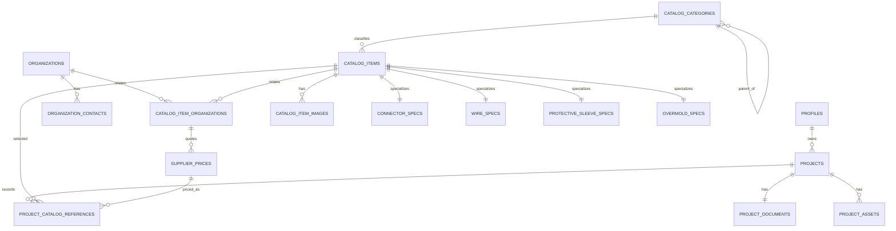

# 线束设计系统 Supabase 后端、项目与共享物料目录设计

生成日期：2026-07-10
适用项目：`wire-harness-designer`
方案：A — React 前端直连 Supabase Auth、Postgres、Storage 与 RLS

## 1. 目标与边界

本设计在保留现有“项目设计文档整体保存”的前提下，新增可复用、可检索、可审计的共享物料目录。它解决连接器、线材、保护套、外模、供应商、图片和历史价格的管理问题。

```text
项目设计域：projects + project_documents(JSONB)
  - 一个项目是一份版本化的 HarnessConfig 聚合
  - 为降低画布编辑与版本迁移复杂度，文档不拆为 PIN / circuit / wire 关系表

共享目录域：catalog_items + 规格表 + 企业/联系人 + 报价 + 图片
  - 一条物料只保留一份公共身份与一份类别专有规格
  - 可被多个项目引用，但目录变更不会改写项目当时的快照
```

这不是对第三范式的例外：共享目录中的可查询主数据完全关系化；`project_documents.document` 是为版本化编辑特意保留的聚合快照。JSONB 内部元素不能作为 PostgreSQL 外键目标，因此以 `project_catalog_references` 保存真实目录与报价外键，并保存引用时快照。

首版采用全局共享目录：所有认证用户可读，只有 `catalog_admin` 可以维护目录、报价、分类、企业与目录图片。项目仍严格按创建者隔离；暂不引入组织/团队、审批流、独立 API 服务、实时协同或模具资产台账。

## 2. 实体关系



### 2.1 命名、键与审计规则

- 全部业务表以 `uuid` 主键，默认 `gen_random_uuid()`；认证用户主键直接复用 `auth.users.id`。
- 所有金额使用 `numeric(18, 6)`，默认货币为 `CNY`；数量、长度和尺寸不混用单位，列名明确为 `_mm`、`_m`、`_c` 等。
- 业务表均保存 `created_at`、`updated_at`、`created_by`、`updated_by`。首次从 `auth.users` 建立 profile 的系统触发器没有用户上下文，因此该 profile 的创建人允许为 `NULL`；其余前端写入由数据库触发器自动使用 `auth.uid()`。
- `catalog_items`、`catalog_categories`、`organizations`、`organization_contacts`、`catalog_item_images` 与项目使用 `deleted_at`、`deleted_by` 软删除。规格表不单独软删除，随父物料隐藏；历史报价使用状态和有效期作废，不物理删除。
- `item_type` 与规格表必须一一对应：连接器只可有 `connector_specs`，其余类别同理。该交叉表约束由目录管理员写入流程（或后续 RPC）校验；关系数据库仍以一对一主外键保证每份规格只属于一个物料。

### 2.2 主要字段字典

| 表 | 关键字段 | 说明 |
| --- | --- | --- |
| `profiles` | `id`, `display_name`, `role` | 应用资料；角色仅为 `user` 或 `catalog_admin`。 |
| `projects` | `owner_id`, `name`, `description`, `status` | 项目元数据和所有权。 |
| `project_documents` | `project_id`, `document`, `schema_version`, `revision` | 完整 `HarnessConfig` 与乐观锁。 |
| `project_assets` | `bucket`, `storage_path`, `mime_type`, `size_bytes` | 项目文件的 Storage 元数据。 |
| `catalog_categories` | `parent_id`, `name`, `code` | `parent_id IS NULL` 为类目，否则为类别；物料必须选择末级类别。 |
| `organizations` | `name`, `organization_kind`, `website` | 制造商、品牌商、贸易商和供应商的公共主体。 |
| `organization_contacts` | `organization_id`, `name`, `phone`, `email` | 一个企业可有多个联系人。 |
| `catalog_items` | `item_type`, `resource_name`, `model`, `manufacturer_part_number`, `category_id` | 四类物料的公共身份、型号和描述。 |
| `catalog_item_organizations` | `item_id`, `organization_id`, `relationship_type` | 品牌商、贸易商、供应商和制造商关系；同一关系不可重复。 |
| `supplier_prices` | `item_organization_id`, `unit_price`, `purchase_unit`, `min_quantity`, `effective_from/to` | 人民币历史报价与数量阶梯。 |
| `catalog_item_images` | `item_id`, `bucket`, `storage_path`, `display_order`, `is_primary` | 一个物料多张图片，至多一张主图。 |
| 四张规格表 | `catalog_item_id` | 使用物料 ID 作为主键和外键，存放仅属于该类别的字段。 |
| `project_catalog_references` | `project_id`, `design_entity_id`, `catalog_item_id`, `supplier_price_id`, `snapshot` | 项目画布元素的目录/报价引用及不可变快照。 |

## 3. 初始化 DDL

以下脚本用于新建 Supabase 项目。生产环境应以 Supabase migration 提交，不应在浏览器执行。脚本未创建任何默认管理员；首次管理员必须由受信任的 Supabase SQL 管理员将对应 `profiles.role` 更新为 `catalog_admin`。

```sql
create extension if not exists pgcrypto;
create extension if not exists btree_gist;

create type public.app_role as enum ('user', 'catalog_admin');
create type public.project_status as enum ('draft', 'in_progress', 'completed', 'archived');
create type public.catalog_item_type as enum ('connector', 'wire', 'protective_sleeve', 'overmold');
create type public.organization_kind as enum ('manufacturer', 'brand_owner', 'trader', 'supplier', 'other');
create type public.organization_relationship_type as enum ('manufacturer', 'brand_owner', 'trader', 'supplier');
create type public.supplier_price_status as enum ('active', 'expired', 'void');
create type public.catalog_image_purpose as enum ('product', 'drawing', 'dimension', 'packaging', 'other');
create type public.project_design_entity_type as enum ('connector', 'wire', 'protective_sleeve', 'overmold');

create table public.profiles (
  id uuid primary key references auth.users(id) on delete cascade,
  display_name text not null default '',
  avatar_path text,
  role public.app_role not null default 'user',
  created_at timestamptz not null default now(),
  updated_at timestamptz not null default now(),
  created_by uuid references public.profiles(id) on delete set null,
  updated_by uuid references public.profiles(id) on delete set null
);

create table public.projects (
  id uuid primary key default gen_random_uuid(),
  owner_id uuid not null references public.profiles(id) on delete restrict,
  name text not null check (length(btrim(name)) between 1 and 200),
  description text not null default '',
  status public.project_status not null default 'draft',
  created_at timestamptz not null default now(),
  updated_at timestamptz not null default now(),
  created_by uuid references public.profiles(id) on delete set null,
  updated_by uuid references public.profiles(id) on delete set null,
  deleted_at timestamptz,
  deleted_by uuid references public.profiles(id) on delete set null
);

create table public.project_documents (
  project_id uuid primary key references public.projects(id) on delete cascade,
  document jsonb not null,
  schema_version integer not null check (schema_version > 0),
  revision bigint not null default 1 check (revision > 0),
  created_at timestamptz not null default now(),
  updated_at timestamptz not null default now(),
  created_by uuid references public.profiles(id) on delete set null,
  updated_by uuid references public.profiles(id) on delete set null
);

create table public.project_assets (
  id uuid primary key default gen_random_uuid(),
  project_id uuid not null references public.projects(id) on delete cascade,
  bucket text not null check (bucket = 'project-assets'),
  storage_path text not null unique,
  file_name text not null,
  mime_type text not null,
  size_bytes bigint not null check (size_bytes >= 0),
  created_at timestamptz not null default now(),
  updated_at timestamptz not null default now(),
  created_by uuid references public.profiles(id) on delete set null,
  updated_by uuid references public.profiles(id) on delete set null,
  deleted_at timestamptz,
  deleted_by uuid references public.profiles(id) on delete set null
);

create table public.catalog_categories (
  id uuid primary key default gen_random_uuid(),
  parent_id uuid references public.catalog_categories(id) on delete restrict,
  name text not null check (length(btrim(name)) between 1 and 100),
  code text not null check (code ~ '^[a-z0-9][a-z0-9_-]{0,63}$'),
  description text not null default '',
  created_at timestamptz not null default now(),
  updated_at timestamptz not null default now(),
  created_by uuid references public.profiles(id) on delete set null,
  updated_by uuid references public.profiles(id) on delete set null,
  deleted_at timestamptz,
  deleted_by uuid references public.profiles(id) on delete set null
);

create table public.organizations (
  id uuid primary key default gen_random_uuid(),
  name text not null check (length(btrim(name)) between 1 and 200),
  organization_kind public.organization_kind not null default 'other',
  website text,
  address text,
  description text not null default '',
  created_at timestamptz not null default now(),
  updated_at timestamptz not null default now(),
  created_by uuid references public.profiles(id) on delete set null,
  updated_by uuid references public.profiles(id) on delete set null,
  deleted_at timestamptz,
  deleted_by uuid references public.profiles(id) on delete set null
);

create table public.organization_contacts (
  id uuid primary key default gen_random_uuid(),
  organization_id uuid not null references public.organizations(id) on delete restrict,
  contact_name text not null check (length(btrim(contact_name)) between 1 and 100),
  job_title text,
  phone text,
  email text,
  is_primary boolean not null default false,
  created_at timestamptz not null default now(),
  updated_at timestamptz not null default now(),
  created_by uuid references public.profiles(id) on delete set null,
  updated_by uuid references public.profiles(id) on delete set null,
  deleted_at timestamptz,
  deleted_by uuid references public.profiles(id) on delete set null,
  check (phone is not null or email is not null)
);

create table public.catalog_items (
  id uuid primary key default gen_random_uuid(),
  item_type public.catalog_item_type not null,
  resource_name text not null check (length(btrim(resource_name)) between 1 and 200),
  model text not null check (length(btrim(model)) between 1 and 200),
  manufacturer_part_number text,
  short_description text not null default '',
  detailed_description text not null default '',
  category_id uuid not null references public.catalog_categories(id) on delete restrict,
  lifecycle_status text not null default 'active'
    check (lifecycle_status in ('draft', 'active', 'inactive')),
  created_at timestamptz not null default now(),
  updated_at timestamptz not null default now(),
  created_by uuid references public.profiles(id) on delete set null,
  updated_by uuid references public.profiles(id) on delete set null,
  deleted_at timestamptz,
  deleted_by uuid references public.profiles(id) on delete set null
);

create table public.catalog_item_organizations (
  id uuid primary key default gen_random_uuid(),
  item_id uuid not null references public.catalog_items(id) on delete restrict,
  organization_id uuid not null references public.organizations(id) on delete restrict,
  relationship_type public.organization_relationship_type not null,
  supplier_sku text,
  note text not null default '',
  created_at timestamptz not null default now(),
  updated_at timestamptz not null default now(),
  created_by uuid references public.profiles(id) on delete set null,
  updated_by uuid references public.profiles(id) on delete set null,
  unique (item_id, organization_id, relationship_type),
  unique (id, relationship_type)
);

create table public.supplier_prices (
  id uuid primary key default gen_random_uuid(),
  item_organization_id uuid not null,
  relationship_type public.organization_relationship_type not null default 'supplier'
    check (relationship_type = 'supplier'),
  currency_code char(3) not null default 'CNY' check (currency_code = 'CNY'),
  purchase_unit text not null check (length(btrim(purchase_unit)) between 1 and 32),
  unit_price numeric(18, 6) not null check (unit_price >= 0),
  min_quantity numeric(18, 6) not null default 1 check (min_quantity > 0),
  max_quantity numeric(18, 6) check (max_quantity is null or max_quantity > min_quantity),
  minimum_order_quantity numeric(18, 6) check (minimum_order_quantity is null or minimum_order_quantity > 0),
  tax_rate numeric(5, 4) check (tax_rate is null or tax_rate between 0 and 1),
  effective_from date not null,
  effective_to date,
  quoted_at date not null default current_date,
  status public.supplier_price_status not null default 'active',
  remark text not null default '',
  created_at timestamptz not null default now(),
  updated_at timestamptz not null default now(),
  created_by uuid references public.profiles(id) on delete set null,
  updated_by uuid references public.profiles(id) on delete set null,
  foreign key (item_organization_id, relationship_type)
    references public.catalog_item_organizations(id, relationship_type) on delete restrict,
  check (effective_to is null or effective_to >= effective_from)
);

alter table public.supplier_prices
  add constraint supplier_prices_no_active_overlap
  exclude using gist (
    item_organization_id with =,
    currency_code with =,
    purchase_unit with =,
    daterange(effective_from, coalesce(effective_to, 'infinity'::date), '[]') with &&,
    numrange(min_quantity, coalesce(max_quantity, 'infinity'::numeric), '[)') with &&
  ) where (status = 'active');

create table public.catalog_item_images (
  id uuid primary key default gen_random_uuid(),
  item_id uuid not null references public.catalog_items(id) on delete restrict,
  bucket text not null check (bucket = 'catalog-assets'),
  storage_path text not null unique,
  file_name text not null,
  mime_type text not null check (mime_type like 'image/%'),
  size_bytes bigint not null check (size_bytes >= 0),
  width_px integer check (width_px is null or width_px > 0),
  height_px integer check (height_px is null or height_px > 0),
  purpose public.catalog_image_purpose not null default 'product',
  display_order integer not null default 0 check (display_order >= 0),
  is_primary boolean not null default false,
  created_at timestamptz not null default now(),
  updated_at timestamptz not null default now(),
  created_by uuid references public.profiles(id) on delete set null,
  updated_by uuid references public.profiles(id) on delete set null,
  deleted_at timestamptz,
  deleted_by uuid references public.profiles(id) on delete set null
);

create table public.connector_specs (
  catalog_item_id uuid primary key references public.catalog_items(id) on delete restrict,
  package text,
  series text,
  connector_type text,
  contact_type text,
  pin_count integer check (pin_count is null or pin_count > 0),
  row_count integer check (row_count is null or row_count > 0),
  pitch_mm numeric(10, 4) check (pitch_mm is null or pitch_mm > 0),
  row_pitch_mm numeric(10, 4) check (row_pitch_mm is null or row_pitch_mm > 0),
  contact_termination text,
  color text,
  features text,
  insulation_material text,
  operating_temperature_min_c numeric(8, 2),
  operating_temperature_max_c numeric(8, 2),
  rohs_status text,
  moisture_sensitivity_level text,
  reach_status text,
  remark text not null default '',
  created_at timestamptz not null default now(), updated_at timestamptz not null default now(),
  created_by uuid references public.profiles(id) on delete set null,
  updated_by uuid references public.profiles(id) on delete set null,
  check (operating_temperature_max_c is null or operating_temperature_min_c is null
         or operating_temperature_max_c >= operating_temperature_min_c)
);

create table public.wire_specs (
  catalog_item_id uuid primary key references public.catalog_items(id) on delete restrict,
  spool_length_m numeric(18, 3) check (spool_length_m is null or spool_length_m > 0),
  conductor_color text,
  package text,
  cable_type text,
  wire_gauge_awg numeric(8, 2) check (wire_gauge_awg is null or wire_gauge_awg > 0),
  conductor_strand_count integer check (conductor_strand_count is null or conductor_strand_count > 0),
  conductor_material text,
  insulation_material text,
  insulation_outer_diameter_mm numeric(10, 4) check (insulation_outer_diameter_mm is null or insulation_outer_diameter_mm > 0),
  insulation_thickness_mm numeric(10, 4) check (insulation_thickness_mm is null or insulation_thickness_mm > 0),
  nominal_length_m numeric(18, 3) check (nominal_length_m is null or nominal_length_m > 0),
  rated_voltage_v numeric(12, 2) check (rated_voltage_v is null or rated_voltage_v > 0),
  operating_temperature_min_c numeric(8, 2),
  operating_temperature_max_c numeric(8, 2),
  jacket_color text,
  created_at timestamptz not null default now(), updated_at timestamptz not null default now(),
  created_by uuid references public.profiles(id) on delete set null,
  updated_by uuid references public.profiles(id) on delete set null,
  check (operating_temperature_max_c is null or operating_temperature_min_c is null
         or operating_temperature_max_c >= operating_temperature_min_c)
);

create table public.protective_sleeve_specs (
  catalog_item_id uuid primary key references public.catalog_items(id) on delete restrict,
  material text,
  color text,
  sleeve_type text,
  shrink_ratio numeric(8, 4) check (shrink_ratio is null or shrink_ratio > 0),
  nominal_length_m numeric(18, 3) check (nominal_length_m is null or nominal_length_m > 0),
  inner_diameter_as_supplied_mm numeric(10, 4) check (inner_diameter_as_supplied_mm is null or inner_diameter_as_supplied_mm > 0),
  inner_diameter_recovered_mm numeric(10, 4) check (inner_diameter_recovered_mm is null or inner_diameter_recovered_mm > 0),
  recovered_wall_thickness_mm numeric(10, 4) check (recovered_wall_thickness_mm is null or recovered_wall_thickness_mm > 0),
  features text,
  operating_temperature_min_c numeric(8, 2),
  operating_temperature_max_c numeric(8, 2),
  shrink_temperature_c numeric(8, 2),
  created_at timestamptz not null default now(), updated_at timestamptz not null default now(),
  created_by uuid references public.profiles(id) on delete set null,
  updated_by uuid references public.profiles(id) on delete set null,
  check (operating_temperature_max_c is null or operating_temperature_min_c is null
         or operating_temperature_max_c >= operating_temperature_min_c)
);

create table public.overmold_specs (
  catalog_item_id uuid primary key references public.catalog_items(id) on delete restrict,
  outer_material text,
  inner_material text,
  color text,
  outer_hardness_shore text,
  length_mm numeric(10, 3) check (length_mm is null or length_mm > 0),
  width_mm numeric(10, 3) check (width_mm is null or width_mm > 0),
  height_mm numeric(10, 3) check (height_mm is null or height_mm > 0),
  compatible_wire_diameter_min_mm numeric(10, 4) check (compatible_wire_diameter_min_mm is null or compatible_wire_diameter_min_mm > 0),
  compatible_wire_diameter_max_mm numeric(10, 4) check (compatible_wire_diameter_max_mm is null or compatible_wire_diameter_max_mm > 0),
  molding_temperature_c numeric(8, 2),
  process_description text not null default '',
  features text,
  remark text not null default '',
  created_at timestamptz not null default now(), updated_at timestamptz not null default now(),
  created_by uuid references public.profiles(id) on delete set null,
  updated_by uuid references public.profiles(id) on delete set null,
  check (compatible_wire_diameter_max_mm is null or compatible_wire_diameter_min_mm is null
         or compatible_wire_diameter_max_mm >= compatible_wire_diameter_min_mm)
);

create table public.project_catalog_references (
  id uuid primary key default gen_random_uuid(),
  project_id uuid not null references public.projects(id) on delete cascade,
  design_entity_type public.project_design_entity_type not null,
  design_entity_id uuid not null,
  catalog_item_id uuid not null references public.catalog_items(id) on delete restrict,
  supplier_price_id uuid references public.supplier_prices(id) on delete restrict,
  snapshot jsonb not null,
  created_at timestamptz not null default now(),
  updated_at timestamptz not null default now(),
  created_by uuid references public.profiles(id) on delete set null,
  updated_by uuid references public.profiles(id) on delete set null,
  unique (project_id, design_entity_type, design_entity_id),
  check (jsonb_typeof(snapshot) = 'object')
);
```

### 3.1 审计触发器与索引

```sql
create or replace function public.set_audit_fields()
returns trigger
language plpgsql
security invoker
set search_path = public
as $$
begin
  if tg_op = 'INSERT' then
    new.created_at := coalesce(new.created_at, now());
    new.created_by := coalesce(auth.uid(), new.created_by);
  end if;
  new.updated_at := now();
  new.updated_by := coalesce(auth.uid(), new.updated_by);
  return new;
end;
$$;

do $$
declare table_name text;
begin
  foreach table_name in array array[
    'profiles', 'projects', 'project_documents', 'project_assets',
    'catalog_categories', 'organizations', 'organization_contacts',
    'catalog_items', 'catalog_item_organizations', 'supplier_prices',
    'catalog_item_images', 'connector_specs', 'wire_specs',
    'protective_sleeve_specs', 'overmold_specs', 'project_catalog_references'
  ] loop
    execute format(
      'create trigger %I before insert or update on public.%I '
      || 'for each row execute function public.set_audit_fields()',
      table_name || '_set_audit_fields', table_name
    );
  end loop;
end;
$$;

create unique index catalog_categories_active_sibling_code_key
  on public.catalog_categories (coalesce(parent_id, '00000000-0000-0000-0000-000000000000'::uuid), code)
  where deleted_at is null;
create unique index organizations_active_name_kind_key
  on public.organizations (name, organization_kind) where deleted_at is null;
create unique index organization_contacts_one_active_primary
  on public.organization_contacts (organization_id) where is_primary and deleted_at is null;
create unique index catalog_items_active_model_key
  on public.catalog_items (item_type, model) where deleted_at is null;
create unique index catalog_item_images_one_active_primary
  on public.catalog_item_images (item_id) where is_primary and deleted_at is null;

create index projects_active_owner_updated_idx
  on public.projects (owner_id, updated_at desc) where deleted_at is null;
create index catalog_items_active_lookup_idx
  on public.catalog_items (item_type, category_id, model) where deleted_at is null and lifecycle_status = 'active';
create index catalog_items_active_resource_name_search_idx
  on public.catalog_items using gin (to_tsvector('simple', resource_name || ' ' || model))
  where deleted_at is null and lifecycle_status = 'active';
create index catalog_item_organizations_lookup_idx
  on public.catalog_item_organizations (organization_id, relationship_type, item_id);
create index supplier_prices_current_lookup_idx
  on public.supplier_prices (item_organization_id, effective_from desc)
  where status = 'active';
create index project_catalog_references_project_idx
  on public.project_catalog_references (project_id, catalog_item_id);
```

`catalog_items_active_model_key` 防止同类型、同型号被重复建立。制造商、品牌商、贸易商、供应商通过关系表关联；若业务要求同型号允许多个制造商，应将型号改为制造商产品编号并在目录管理员导入流程中使用“物料类型 + 制造商 + 制造商产品编号”去重。

## 4. 图片、报价与项目引用

### 4.1 多图方案

连接器不是特殊例外；四种物料统一使用 `catalog_item_images`。图片本体存储在 Supabase Storage，表中只存安全路径、文件元数据、显示顺序、用途和主图标记。

```text
catalog-assets/{itemId}/{imageId}-{safeFileName}
project-assets/{projectId}/{assetId}-{safeFileName}
```

上传步骤：先创建物料/图片元数据 ID → 上传至对应 Storage 路径 → 写入 `catalog_item_images`。删除图片时先软删除元数据；经保留期后由受信任的后台任务使用 service role 删除文件本体。浏览器永不持有 service role key。

### 4.2 供应商历史价格

一条 `supplier_prices` 表示“某供应商对某物料、某采购单位、某数量区间、某时间区间”的人民币报价。`supplier_prices_no_active_overlap` 排斥约束禁止同一供应关系、单位、时间和数量区间存在两个同时生效的报价。新价格应新增记录并关闭旧记录的有效期，而不是覆盖旧单价。

查询某日、某数量的最低有效报价：

```sql
select sp.*
from public.supplier_prices sp
join public.catalog_item_organizations cio on cio.id = sp.item_organization_id
where cio.item_id = :catalog_item_id
  and sp.status = 'active'
  and sp.effective_from <= :on_date
  and (sp.effective_to is null or sp.effective_to >= :on_date)
  and sp.min_quantity <= :quantity
  and (sp.max_quantity is null or sp.max_quantity > :quantity)
order by sp.unit_price asc, sp.effective_from desc
limit 1;
```

项目选择目录物料时，在 `project_catalog_references.snapshot` 写入当时的资源名称、型号、规格摘要、供应商、采购单位、单价与币种；因此目录修订、价格失效或物料软删除不会改变已保存项目的 BOM。

## 5. RLS 与 Storage

所有通过 Supabase Data API 暴露的 `public` 表都必须启用 RLS。使用 `security definer` 管理员函数避免目录策略递归读取 `profiles`，并固定 `search_path`。

```sql
create or replace function public.is_catalog_admin()
returns boolean
language sql
stable
security definer
set search_path = public
as $$
  select exists (
    select 1 from public.profiles
    where id = auth.uid() and role = 'catalog_admin'
  );
$$;

revoke all on function public.is_catalog_admin() from public;
grant execute on function public.is_catalog_admin() to authenticated;

-- 普通用户只能改自己的资料；列级权限阻止其提升 role 或篡改审计列。
revoke update on public.profiles from authenticated;
grant update (display_name, avatar_path) on public.profiles to authenticated;

alter table public.profiles enable row level security;
create policy "profile owner can read" on public.profiles for select to authenticated
  using ((select auth.uid()) = id);
create policy "profile owner can update allowed columns" on public.profiles for update to authenticated
  using ((select auth.uid()) = id) with check ((select auth.uid()) = id);

-- 项目域：仅项目拥有者访问。客户端默认过滤 deleted_at，恢复功能仍可读取软删除项目。
alter table public.projects enable row level security;
create policy "owners read projects" on public.projects for select to authenticated
  using (owner_id = (select auth.uid()));
create policy "owners create projects" on public.projects for insert to authenticated
  with check (owner_id = (select auth.uid()));
create policy "owners soft delete or update projects" on public.projects for update to authenticated
  using (owner_id = (select auth.uid())) with check (owner_id = (select auth.uid()));

alter table public.project_documents enable row level security;
create policy "owners read project documents" on public.project_documents for select to authenticated
  using (exists (select 1 from public.projects p where p.id = project_id
                 and p.owner_id = (select auth.uid())));
create policy "owners create project documents" on public.project_documents for insert to authenticated
  with check (exists (select 1 from public.projects p where p.id = project_id
                 and p.owner_id = (select auth.uid())));
create policy "owners update project documents" on public.project_documents for update to authenticated
  using (exists (select 1 from public.projects p where p.id = project_id
                 and p.owner_id = (select auth.uid())))
  with check (exists (select 1 from public.projects p where p.id = project_id
                 and p.owner_id = (select auth.uid())));

alter table public.project_assets enable row level security;
create policy "owners read project assets" on public.project_assets for select to authenticated
  using (exists (select 1 from public.projects p where p.id = project_id
                 and p.owner_id = (select auth.uid())));
create policy "owners create project assets" on public.project_assets for insert to authenticated
  with check (exists (select 1 from public.projects p where p.id = project_id
                 and p.owner_id = (select auth.uid())));
create policy "owners update project assets" on public.project_assets for update to authenticated
  using (exists (select 1 from public.projects p where p.id = project_id
                 and p.owner_id = (select auth.uid())))
  with check (exists (select 1 from public.projects p where p.id = project_id
                 and p.owner_id = (select auth.uid())));

alter table public.project_catalog_references enable row level security;
create policy "owners read project catalog references" on public.project_catalog_references for select to authenticated
  using (exists (select 1 from public.projects p where p.id = project_id
                 and p.owner_id = (select auth.uid())));
create policy "owners create project catalog references" on public.project_catalog_references for insert to authenticated
  with check (exists (select 1 from public.projects p where p.id = project_id
                 and p.owner_id = (select auth.uid())));
create policy "owners update project catalog references" on public.project_catalog_references for update to authenticated
  using (exists (select 1 from public.projects p where p.id = project_id
                 and p.owner_id = (select auth.uid())))
  with check (exists (select 1 from public.projects p where p.id = project_id
                 and p.owner_id = (select auth.uid())));

-- 目录域：认证用户读未删除记录；管理员写所有目录记录。
alter table public.catalog_categories enable row level security;
alter table public.organizations enable row level security;
alter table public.organization_contacts enable row level security;
alter table public.catalog_items enable row level security;
alter table public.catalog_item_organizations enable row level security;
alter table public.supplier_prices enable row level security;
alter table public.catalog_item_images enable row level security;
alter table public.connector_specs enable row level security;
alter table public.wire_specs enable row level security;
alter table public.protective_sleeve_specs enable row level security;
alter table public.overmold_specs enable row level security;

create policy "read active categories" on public.catalog_categories for select to authenticated using (deleted_at is null);
create policy "read active organizations" on public.organizations for select to authenticated using (deleted_at is null);
create policy "read active organization contacts" on public.organization_contacts for select to authenticated using (
  deleted_at is null and exists (select 1 from public.organizations o where o.id = organization_id and o.deleted_at is null));
create policy "read active catalog items" on public.catalog_items for select to authenticated using (deleted_at is null);
create policy "read active item organizations" on public.catalog_item_organizations for select to authenticated using (
  exists (select 1 from public.catalog_items i where i.id = item_id and i.deleted_at is null)
  and exists (select 1 from public.organizations o where o.id = organization_id and o.deleted_at is null));
create policy "read active supplier prices" on public.supplier_prices for select to authenticated using (
  exists (select 1 from public.catalog_item_organizations cio join public.catalog_items i on i.id = cio.item_id
          where cio.id = item_organization_id and i.deleted_at is null));
create policy "read active catalog images" on public.catalog_item_images for select to authenticated using (
  deleted_at is null and exists (select 1 from public.catalog_items i where i.id = item_id and i.deleted_at is null));
create policy "read active connector specs" on public.connector_specs for select to authenticated using (
  exists (select 1 from public.catalog_items i where i.id = catalog_item_id and i.deleted_at is null));
create policy "read active wire specs" on public.wire_specs for select to authenticated using (
  exists (select 1 from public.catalog_items i where i.id = catalog_item_id and i.deleted_at is null));
create policy "read active sleeve specs" on public.protective_sleeve_specs for select to authenticated using (
  exists (select 1 from public.catalog_items i where i.id = catalog_item_id and i.deleted_at is null));
create policy "read active overmold specs" on public.overmold_specs for select to authenticated using (
  exists (select 1 from public.catalog_items i where i.id = catalog_item_id and i.deleted_at is null));

do $$
declare table_name text;
begin
  foreach table_name in array array[
    'catalog_categories', 'organizations', 'organization_contacts', 'catalog_items',
    'catalog_item_organizations', 'supplier_prices', 'catalog_item_images',
    'connector_specs', 'wire_specs', 'protective_sleeve_specs', 'overmold_specs'
  ] loop
    execute format('create policy %I on public.%I for insert to authenticated with check ((select public.is_catalog_admin()))',
                   table_name || ' insertable by catalog admins', table_name);
    execute format('create policy %I on public.%I for update to authenticated using ((select public.is_catalog_admin())) with check ((select public.is_catalog_admin()))',
                   table_name || ' updatable by catalog admins', table_name);
  end loop;
end;
$$;

-- Bucket 需先在 Dashboard 或 migration 中创建：catalog-assets、project-assets。
-- catalog-assets：认证用户读取；仅目录管理员写入。
create policy "authenticated users read catalog assets" on storage.objects for select to authenticated
  using (bucket_id = 'catalog-assets');
create policy "catalog admins upload catalog assets" on storage.objects for insert to authenticated
  with check (bucket_id = 'catalog-assets' and (select public.is_catalog_admin()));
create policy "catalog admins update catalog assets" on storage.objects for update to authenticated
  using (bucket_id = 'catalog-assets' and (select public.is_catalog_admin()))
  with check (bucket_id = 'catalog-assets' and (select public.is_catalog_admin()));

-- project-assets：路径首段为 project_id，且必须属于当前用户。
create policy "owners read project assets in storage" on storage.objects for select to authenticated
  using (
    bucket_id = 'project-assets'
    and exists (
      select 1 from public.projects p
      where p.id::text = (storage.foldername(name))[1]
        and p.owner_id = (select auth.uid()) and p.deleted_at is null
    )
  );
create policy "owners upload project assets in storage" on storage.objects for insert to authenticated
  with check (
    bucket_id = 'project-assets'
    and exists (
      select 1 from public.projects p
      where p.id::text = (storage.foldername(name))[1]
        and p.owner_id = (select auth.uid()) and p.deleted_at is null
    )
  );
create policy "owners update project assets in storage" on storage.objects for update to authenticated
  using (
    bucket_id = 'project-assets'
    and exists (
      select 1 from public.projects p
      where p.id::text = (storage.foldername(name))[1]
        and p.owner_id = (select auth.uid()) and p.deleted_at is null
    )
  )
  with check (
    bucket_id = 'project-assets'
    and exists (
      select 1 from public.projects p
      where p.id::text = (storage.foldername(name))[1]
        and p.owner_id = (select auth.uid()) and p.deleted_at is null
    )
  );
```

目录 RLS 已直接排除软删除记录；管理员“回收站”应通过受控的管理员 RPC 或不暴露给普通用户的管理视图访问。客户端查询仍应附加 `deleted_at is null`，以使其意图清晰并避免依赖安全策略过滤。

## 6. 项目保存与接口影响

`ProjectRepository` 保持其抽象边界，并在 Supabase 实现中将 `load` 返回的 `revision` 用于条件更新：

```sql
update public.project_documents
set document = :document,
    schema_version = :schema_version,
    revision = revision + 1
where project_id = :project_id
  and revision = :expected_revision
returning revision, updated_at;
```

返回 0 行表示冲突、无权限或项目不存在；客户端应进入 `conflict` 状态而非覆盖远端。新的目录读取接口按 `catalog_items` 联接类别、规格、组织关系、主图与有效报价返回；项目写入时同步维护 `project_catalog_references`，不可只把目录 ID 埋入 JSONB。

建议的前端类型边界：

```ts
type CatalogItemType = 'connector' | 'wire' | 'protective_sleeve' | 'overmold';

interface CatalogItemSummary {
  id: string;
  itemType: CatalogItemType;
  resourceName: string;
  model: string;
  categoryId: string;
  primaryImagePath?: string;
}

interface ProjectCatalogReferenceInput {
  designEntityType: CatalogItemType;
  designEntityId: string;
  catalogItemId: string;
  supplierPriceId?: string;
  snapshot: Record<string, unknown>;
}
```

## 7. 实施顺序

1. 创建 Supabase 项目、环境变量、`profiles` 触发器和首个目录管理员；配置 `catalog-assets` 与 `project-assets` 私有 bucket。
2. 执行项目域、目录域、审计触发器、约束、索引和 RLS migration；先以空库验证，再导入本地 `CONNECTORS` 的最小数据集。
3. 开发目录管理员维护界面和只读物料选择器；图片先上传 Storage，再写元数据记录。
4. 开发供应商、联系人和历史报价维护；报价新增而非覆盖，并以有效期关闭旧报价。
5. 新增 `SupabaseProjectRepository`、认证替换、项目/目录引用和快照写入；`HarnessConfig` 只保存设计所需的引用与快照。
6. 最后迁移项目图片与导出文件，少量真实用户试用后再考虑 Edge Functions、Realtime 或团队权限。

## 8. 验证与验收

- 在空 Supabase 项目执行 migration，确认所有表、枚举、主外键、`check`、排斥约束、触发器、索引和 RLS 策略可创建。
- 新建一个连接器、关联三张 `catalog_item_images`，确认数据库拒绝第二张未删除主图；验证线材、保护套和外模也可复用同一图片机制。
- 对同一供应商/物料建立不同生效期和数量区间的 CNY 报价；确认重叠的有效报价被拒绝，历史报价不被覆盖，按日期和数量可取到正确价格。
- 验证普通认证用户可读有效目录但不能写目录、改报价、上传目录图片或修改自身 `role`；`catalog_admin` 可维护目录。
- 验证用户 A 无法读取、更新或上传到用户 B 的项目；已软删除物料不出现在默认目录，已保存项目仍可通过快照还原其 BOM。
- 验证两个标签页以相同 `revision` 保存同一项目时，第二次保存返回 0 行且客户端展示冲突而不是静默覆盖。

## 9. 官方参考

- [Supabase Row Level Security](https://supabase.com/docs/guides/database/postgres/row-level-security)
- [Supabase Storage Access Control](https://supabase.com/docs/guides/storage/security/access-control)
- [Supabase Auth](https://supabase.com/docs/guides/auth)
- [Supabase Storage](https://supabase.com/docs/guides/storage)
